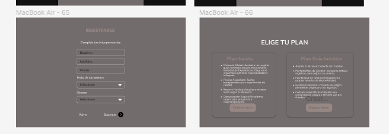
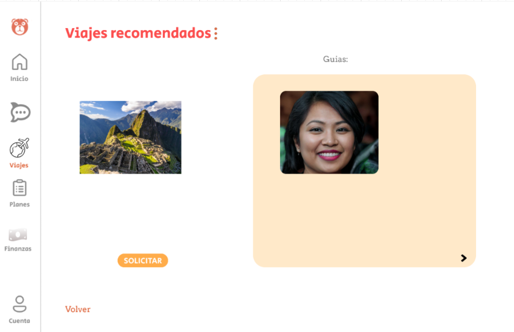
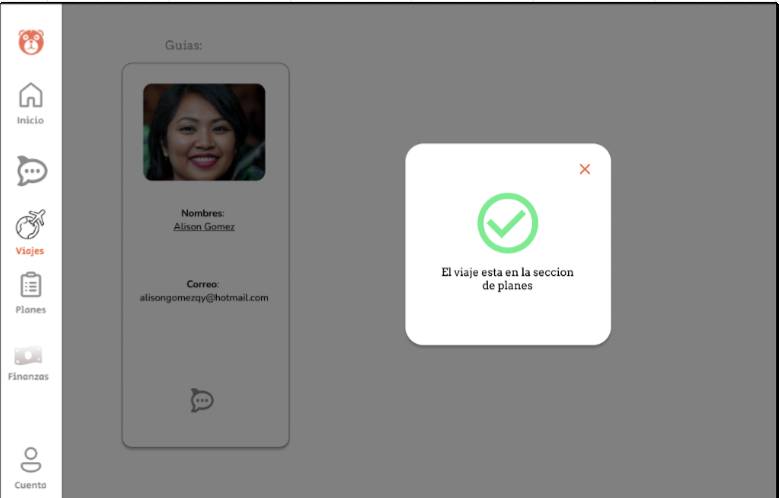
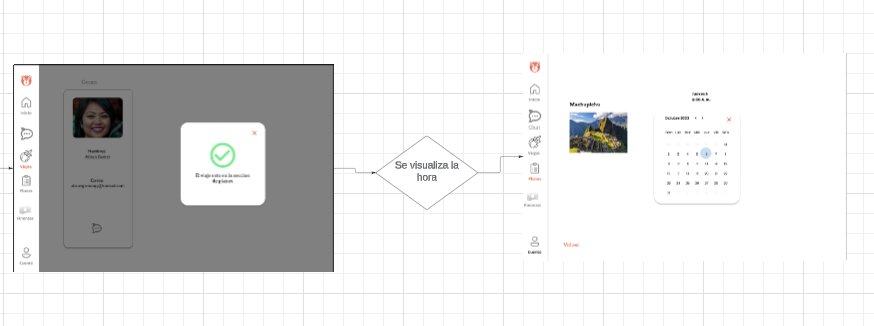
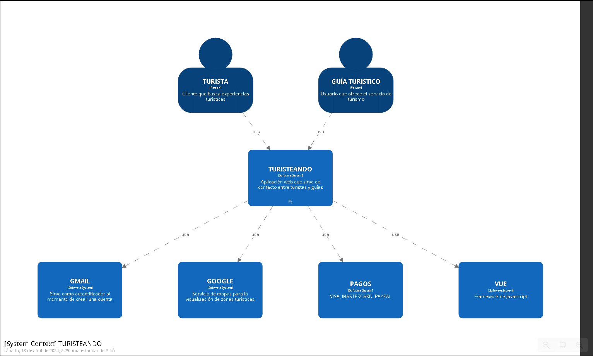
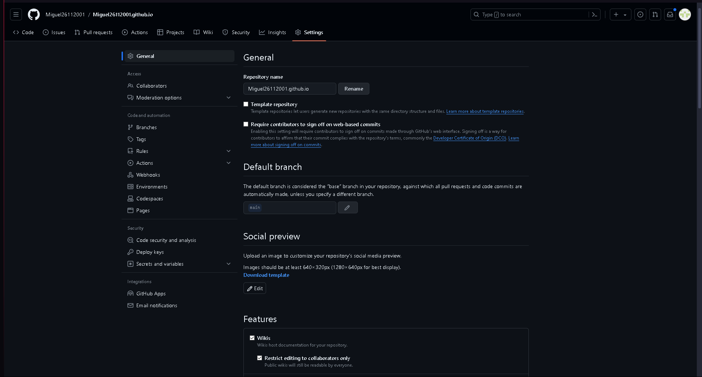

Universidad Peruana de ciencias aplicadas

5to ciclo

Aplicaciones Web

WS51

Hugo Allan Mori Paiva

"Informe de Trabajo 1"

Grupo: 1

Producto: **Turisteros Ventures**

Relación de integrantes:

- Carlos Alejandro De La Cruz Villarreal

- Diego Rolin Acuña Tomas

- Miguel Angel Gomez Hurtado

- Enzo Paolo Noblecilla Jimenez

Tabla de contenidos

## Registro de versiones 

<table style="width:100%;">
<colgroup>
<col style="width: 25%" />
<col style="width: 24%" />
<col style="width: 24%" />
<col style="width: 24%" />
</colgroup>
<thead>
<tr class="header">
<th>Versión</th>
<th>Fecha</th>
<th>Autor</th>
<th>Descripción y modificación</th>
</tr>
<tr class="odd">
<th>1.0</th>
<th>30/03/2023</th>
<th>
Acuña Tomas, Diego Rolin

De La Cruz Villarreal, Carlos Alejandro

Miguel Angel Gomez Hurtado

<mark>Enzo Paolo Noblecilla Jimenez</mark>
</th>
<th>
Capítulo 1

Capítulo 2

Capítulo 3

Capítulo 4

5.1.

5.2.
</th>
</tr>
</thead>
<tbody>
</tbody>
</table>

## Student outcome

<table>
<colgroup>
<col style="width: 33%" />
<col style="width: 33%" />
<col style="width: 33%" />
</colgroup>
<thead>
<tr class="header">
<th>Criterio Específico</th>
<th>Acciones realizadas</th>
<th>Conclusiones</th>
</tr>
<tr class="odd">
<th>Comunica oralmente sus ideas y/o resultados con objetividad a
público de diferentes especialidades y niveles jerárquicos, en el marco
del desarrollo de un proyecto en ingeniería.</th>
<th>
De La Cruz Villarreal, Carlos Alejandro

TB1: Realización de entrevistas y reuniones para acordar las
responsabilidades de cada integrante.

Acuña Tomas, Diego Rolin

TB1:

Identificar segmentos objetivos, y grabar las entrevistas. Por
último, reunirnos para repartir partes.

Miguel Angel Gomez Hurtado

TB1: Realización de los LeanUx, creación de los diagramas 4c
(DDD).

Es fundamental que se realicen en conjunto los puntos establecidos en
el documento del final statement, así mismo el cumplimiento de tareas en
las reuniones.
</th>
<th>
TB1:

En conclusión, en este primer entregable hemos iniciado con nuestra
investigación para apoyar a las comunidades rurales y los guías locales
a poder contactar con potenciales clientes como pueden ser los turistas.
A su vez, ya tenemos el primer prototipo de nuestra landing page, como a
su vez hemos iniciado con las descripciones de funcionalidades de
nuestra aplicación web.
</th>
</tr>
<tr class="header">
<th>Comunica en forma escrita ideas y/o resultados con objetividad a
público de diferentes especialidades y niveles jerárquicos, en el marco
del desarrollo de un proyecto en ingeniería.</th>
<th>
De La Cruz Villarreal, Carlos Alejandro

TB1: Realización de los Lean ux hypothesis statements y Lean ux
canvas, as-is scenary map y to-be scenary map, impact map y product
backlog.

Acuña Tomas, Diego Rolin

TB1:

Realización de los Lean Ux, hypothesis.

Miguel Angel Gomez Hurtado

TB1: Debido a la realización de este proyecto, algunas conclusiones a
las que llegamos son que el uso de aplicaciones web para dar soluciones
a problemas reales resulta muy práctico. Además, hacer uso de frameworks
como VUE para facilitar el trabajo de desarrollo resulta muy
conveniente.
</th>
<th></th>
</tr>
</thead>
<tbody>
</tbody>
</table>

# Capítulo 1:

## 1.1. Startup Profile

## 1.1.1. Descripción de la Startup

**Descripción de la empresa:**

Turisteros Ventures es una startup con el objetivo de facilitar la
adquisición de la cultura e historia que permite la visita a los lugares
más hermosos del mundo. Países como el Perú, con sus construcciones
antiguas, selvas y montañas, es fácil olvidar que cada paisaje o
construcción histórica tiene muchas historias y curiosidades. Los que
pueden contarnos esas historias son los guías, sin embargo, es difícil
contactar con uno sin la probabilidad de ser estafados. Nosotros
enfrentaremos esta problemática en el turismo, ofreciendo una solución
tecnológica que permita la comunicación directa y confiable entre los
turistas y los guías turísticos.

**Visión:**

Aspiramos a liderar la promoción del turismo vivencial en las apartadas
localidades andinas, brindando a los intrépidos viajeros un acceso
sencillo y seguro a experiencias auténticas y memorables. Nuestra meta
es establecer un vínculo sólido entre las comunidades locales y los
visitantes, fomentando el respeto por la cultura y el entorno natural, y
contribuyendo al desarrollo sostenible de las regiones que abarcamos.

**Misión:**

Nuestra misión radica en establecer conexiones significativas entre
viajeros y culturas locales, promoviendo experiencias turísticas
auténticas que enriquezcan la vida de nuestros usuarios y contribuyan al
bienestar de las comunidades anfitrionas. Nos comprometemos a
proporcionar un servicio excepcional, impulsado por la innovación y una
apasionada dedicación al turismo responsable.

**Descripción del producto:**

Turisteando, nuestra propuesta, emerge como una plataforma digital
innovadora diseñada para vincular a los intrépidos viajeros con guías
locales y proveedores de servicios turísticos en las remotas zonas
andinas. Con un enfoque centrado en el turismo vivencial, busca
satisfacer la creciente demanda de vivencias auténticas y significativas
en entornos naturales singulares. Ofrecemos una solución integral para
aquellos que buscan explorar destinos menos convencionales al facilitar
la comunicación a través de mapas interactivos que detallan rutas,
sitios a visitar, horarios de partida y llegada, así como perfiles
detallados que incluyen información sobre la formación del guía,
licencias pertinentes y otros datos relevantes. Además, los usuarios
pueden consultar opiniones de otros viajeros que han utilizado sus
servicios.

**Características:**

- Mapas detallados e interactivos: En Turisteando, ofrecemos mapas
  interactivos meticulosamente elaborados que trazan la ruta guiada,
  destacando puntos clave con información relevante, como el nombre del
  lugar y la hora estimada de llegada.

<!-- -->

- Búsqueda avanzada: Nuestra plataforma permite a los usuarios afinar su
  búsqueda según sus preferencias, incluyendo país, distrito, lugares de
  interés, horarios y precios. Así, se les presenta una lista de guías
  que pueden satisfacer sus necesidades específicas.

<!-- -->

- Confirmación de identidad: Para garantizar la seguridad de nuestros
  usuarios, requerimos que todos los guías autentiquen su identidad y
  licencia antes de ofrecer servicios a través de nuestra plataforma.
  Esto proporciona tranquilidad a quienes buscan servicios de guía,
  evitando posibles engaños o estafas..

<!-- -->

- Comunidad y comentarios: Fomentamos la participación de los usuarios
  al permitirles dejar comentarios, valoraciones y sugerencias sobre los
  servicios de guía. Esta función promueve la transparencia y la
  confianza en nuestra comunidad, ofreciendo información valiosa que
  complementa la descripción estándar de los servicios y guías.

### 1.1.2. Perfiles de integrantes del equipo

**Nombre**: Carlos Alejandro De La Cruz Villarreal

**Código**:U20211C036

**Carrera**: Ingeniería de Software

Soy un estudiante de Ingeniería de Software, tengo 21 años y vivo en
Lima. Mis pasatiempos son hacer deporte, jugar videojuegos y escuchar
música. Me gusta trabajar en equipo porque de esta manera todos los
integrantes podemos dar nuestro punto de vista e ideas para poder lograr
el objetivo del curso. Además, para este curso me comprometo a ayudar en
todo lo posible para la elaboración y desarrollo del trabajo.

**Nombre**: Diego Rolin Acuña Tomas

**Código**: u202221436

**Carrera**: Ingeniería de Software

Mi nombre es Diego Acuña y soy estudiante de la carrera de ingeniería de
software, soy un entusiasta de la programación, y muy curioso al
aprender nuevos lenguajes de programación y cursos. Se codear en Python
y C++, pero espero aprender más lenguajes este año. Quisiera
especializarme en data science y tener mi propia empresa en el futuro.

**Nombre**: Miguel Angel Gomez Hurtado

**Código**: u202220294

**Carrera**: Ingeniería de Software

Tengo 21 años y estoy estudiando la carrera de Ingeniería Informática.
Me encuentro en mi segundo ciclo en la UPC Sede San Miguel. Soy una
persona académica y siempre estoy abierto al diálogo. Me apasiona mi
carrera y siempre estoy dispuesto a aprender sobre este curso para
brindar a mis futuros usuarios un buen producto acorde a sus
necesidades.

**Nombre**: Enzo Paolo Noblecilla Jimenez

**Código**: U202119447

**Carrera**: Ingeniería de Software

Soy estudiante de la carrera de Ingeniería de Software en la UPC .Me
considero una persona hábil a la hora de buscar información, y gracias a
esto estoy dispuesto a aprender nuevas cosas y a su vez aplicarlas al
día a día. Soy paciente y tranquilo, ofreciendo al equipo una persona en
la cual confía

## 1.2. Solution Profile

**Descripción del producto:** Turisteando

### 1.2.1 Antecedentes y problemática:

En esta parte utilizamos el 5w 2h para conocer los puntos importantes
del problema al cual nos enfrentamos:

Quién (Who):

Usuarios: El foco principal son los viajeros aventureros y amantes de la
naturaleza. Estos son los individuos que buscan experiencias auténticas
y memorables en entornos naturales únicos.

Clientes potenciales: Los guías locales y los proveedores de servicios
turísticos en áreas remotas de los pueblos andinos son los que ofrecen
servicios y experiencias a los usuarios.

Qué (What):

Desarrollo de una plataforma digital: El proyecto implica la creación de
una plataforma digital que actúa como un intermediario entre los
usuarios y los proveedores de servicios turísticos. Su función principal
es facilitar la reserva de experiencias vivenciales en áreas remotas de
los pueblos andinos.

Dónde (Where):

Inicialmente, la plataforma se enfocará en áreas remotas de los pueblos
andinos. Sin embargo, existe la posibilidad de expandirse hacia otras
regiones con características similares en el futuro.

Cuándo (When):

La problemática surge de la falta de gestión adecuada del turismo en el
Perú. El desarrollo y lanzamiento de la plataforma se llevarán a cabo en
un período de tiempo específico para abordar esta cuestión.

Por qué (Why):

El objetivo principal del proyecto es abordar la falta de acceso a
experiencias turísticas auténticas en áreas remotas de los pueblos
andinos. Además, busca satisfacer la creciente demanda de turismo
vivencial entre los viajeros aventureros y amantes de la naturaleza.

Cómo (How):

El desarrollo de la plataforma se llevará a cabo mediante la creación de
una aplicación web que facilite la conexión entre los usuarios, los
guías locales y los proveedores de servicios turísticos en áreas
remotas. Esta aplicación permitirá la reserva de experiencias y la
comunicación durante el viaje.

Cuánto (How much):

Los costos asociados pueden variar según factores como el desarrollo de
la aplicación, los gastos de marketing y las tarifas de membresía para
los proveedores de servicios turísticos.

### 1.2.2 Lean UX Process.

#### 1.2.2.1. Lean UX Problem Statements.

El problema que aborda nuestra aplicación es la necesidad de brindar a
los guías turísticos una alternativa efectiva para conectarse con los
turistas, facilitando así los viajes de turismo vivencial y promoviendo
los servicios de los guías. Observamos que factores como la dificultad
para los turistas de experimentar la autenticidad y belleza de los
pueblos andinos, así como la falta de oportunidades para que los guías
locales promocionan sus servicios y compartan su conocimiento, podrían
afectar negativamente a nuestra aplicación.

Para abordar este problema, nuestra visión es desarrollar una plataforma
digital que conecte a los viajeros aventureros con guías locales
expertos en pueblos andinos, ofreciendo un acceso fácil y seguro a
experiencias turísticas auténticas y memorables.

Algunas preguntas clave que debemos considerar incluyen: ¿Cómo podemos
fortalecer la confianza de nuestros clientes en nuestra plataforma? ¿Qué
importancia tiene una plataforma centrada en el turismo vivencial en
este contexto? Estas interrogantes nos ayudarán a definir estrategias
efectivas para el desarrollo y posicionamiento de nuestra aplicación.

#### 1.2.2.2. Lean UX Assumptions.

Business outcomes:

Conexión efectiva entre guías locales y turistas: Nuestro principal
objetivo es facilitar la conexión entre los guías locales y los
turistas, satisfaciendo así la creciente demanda de experiencias
auténticas en entornos naturales remotos. Al lograr esto, esperamos
generar ingresos mediante la oferta de paquetes turísticos
personalizados que incluyan actividades exclusivas y significativas.

Generación de ingresos: Al proporcionar una plataforma que permite a los
turistas acceder a experiencias auténticas guiadas por expertos locales,
esperamos generar ingresos a través de la venta de paquetes turísticos y
la facilitación de transacciones entre guías y turistas.

User benefits:

Acceso a experiencias auténticas: Nuestra plataforma brindará a los
usuarios la oportunidad de sumergirse en la cultura local y la belleza
natural de lugares remotos a través de experiencias auténticas de
turismo vivencial. Podrán participar en actividades interactivas y
enriquecedoras, como excursiones guiadas por expertos locales, talleres
de artesanía tradicional y encuentros con comunidades indígenas.

Conveniencia y seguridad: Los usuarios disfrutarán de la conveniencia de
poder planificar y reservar sus experiencias directamente a través de
nuestra plataforma, garantizando al mismo tiempo la seguridad y
confianza en la autenticidad de los servicios ofrecidos por los guías
locales.

Users & Customers:

Usuarios: Nuestros usuarios principales serán viajeros aventureros y
amantes de la naturaleza que buscan experiencias únicas y significativas
en sus viajes. Ellos encontrarán en nuestra plataforma una amplia
variedad de opciones de turismo vivencial en áreas remotas, conectándose
directamente con guías locales y proveedores de servicios turísticos.

Clientes: Nuestros clientes serán los guías locales y los proveedores de
servicios turísticos en áreas remotas. Ellos se beneficiarán al tener
acceso a una plataforma que les permitirá llegar a una audiencia más
amplia y diversa, promocionar sus servicios de manera efectiva y
gestionar las transacciones de manera segura y conveniente.

1\. ¿Quién(es) es el Usuario?

Los usuarios de nuestra plataforma son personas que valoran las
experiencias auténticas y desean explorar destinos fuera de lo común en
contacto directo con la naturaleza y la cultura local.

2\. ¿Dónde Encaja Nuestro Producto en su Trabajo o Vida?

Nuestro producto se integra en la planificación y ejecución de viajes de
turismo vivencial, ofreciendo a los usuarios acceso a una variedad de
experiencias y actividades en entornos naturales remotos.

3\. ¿Qué Problemas tiene nuestro producto? ¿Qué Resuelve?

Uno de los desafíos clave es garantizar la calidad y seguridad de las
experiencias ofrecidas por los guías turísticos en nuestra plataforma.
Además de facilitar la interacción con ellos mediante una interfaz web.

4\. ¿Cuándo y Cómo se usa nuestro Producto?

Nuestro producto se utiliza durante la fase de planificación y reserva
del viaje. En otras palabras, desde que el cliente turista quiere
planificar su viaje y quiere adquirir el equipamiento, así como los
conocimientos e información pertinente para su estadía.

5\. ¿Qué características son importantes?

Es crucial que nuestro producto ofrezca información detallada sobre las
experiencias ofrecidas, incluyendo ubicación, itinerario y requisitos
previos. También es importante facilitar la comunicación entre los
usuarios y los proveedores de servicios turísticos locales.

6\. ¿Cómo Debe Verse Nuestro Producto y Cómo Debe Comportarse?

Nuestro producto debe tener una interfaz intuitiva y atractiva que
refleje la naturaleza aventurera y emocionante del turismo vivencial.
Debe ser fácil de navegar y permitir a los usuarios encontrar y reservar
experiencias de manera rápida y sencilla.

¿Qué Ofrece Nuestro Producto?

1.  Creemos que Nuestros Clientes Necesitan: Una plataforma que les
    brinde acceso a experiencias auténticas de turismo vivencial en
    áreas remotas y de difícil acceso.

2.  Estas Necesidades se Pueden Resolver con: Una aplicación móvil que
    conecte a los usuarios con guías locales y proveedores de servicios
    turísticos en áreas remotas, facilitando la reserva de experiencias
    y la comunicación durante el viaje.

3.  Nuestros Clientes Son o Serán: Viajeros aventureros y amantes de la
    naturaleza que buscan experiencias únicas y significativas en
    destinos fuera de lo común.

4.  El Valor Principal que un Cliente Quiere de Nuestro Servicio es:
    Acceso a experiencias auténticas y significativas en entornos
    naturales remotos.

5.  El Cliente También Puede Obtener Estos Beneficios Adicionales:

    1.  Interacción con guías locales y comunidades indígenas.

    2.  Seguridad y confianza en la calidad de las experiencias
        ofrecidas.

    3.  Apoyo en la planificación y ejecución de viajes a áreas de
        difícil acceso.

    4.  Adquiriremos la mayoría de nuestros clientes a través de: Una
        estrategia de marketing digital centrada en destacar la
        autenticidad y exclusividad de nuestras experiencias de turismo
        vivencial, dirigida a viajeros aventureros y amantes de la
        naturaleza.

6.  Generamos Ingresos a través de: Comisiones por reservas realizadas a
    través de nuestra plataforma y tarifas de membresía para proveedores
    de servicios turísticos locales.

7.  Nuestra Competencia Principal en el Mercado será: Otras plataformas
    de reserva de experiencias y operadores turísticos tradicionales que
    ofrecen viajes a destinos convencionales.

8.  Los Venceremos Debido a: Nuestra especialización en turismo
    vivencial y nuestra amplia red de guías locales y proveedores de
    servicios turísticos en áreas remotas.

9.  Nuestro Mayor Riesgo de Producto es: La falta de disponibilidad de
    servicios básicos en áreas de difícil acceso, como alojamiento y
    transporte.

10. Generamos Ingresos a través de: Comisiones por reservas realizadas a
    través de nuestra plataforma y tarifas de membresía para proveedores
    de servicios turísticos locales.

11. Nuestra Competencia Principal en el Mercado Será: Otras plataformas
    de reserva de experiencias y operadores turísticos tradicionales que
    ofrecen viajes a destinos convencionales.

12. Los Venceremos Debido a: Nuestra especialización en turismo
    vivencial y nuestra amplia red de guías locales y proveedores de
    servicios turísticos en áreas remotas.

13. Nuestro Mayor Riesgo de Producto es: La falta de disponibilidad de
    servicios básicos en áreas de difícil acceso, como alojamiento y
    transporte.

14. Resolveremos esto a través de: Asociaciones estratégicas con
    proveedores de servicios turísticos locales y el desarrollo de
    soluciones innovadoras para abordar estas necesidades específicas..

#### 1.2.2.3. Lean UX Hypothesis Statements.

> · **Usuario cliente:**
>
> **Hypothetical Statement: Comentarios de los usuarios**

**Creemos que**, si agregamos una función en nuestra página web donde la
gente pueda compartir sus opiniones y leer los comentarios de otros
usuarios sobre los guías turísticos que han contratado.

**Lograremos** que más clientes participen activamente en la página y se
beneficien de la experiencia de otros para tomar decisiones más
informadas sobre qué guía contratar.

**Sabremos que hemos tenido éxito**, cuando veamos un aumento del 50% en
la demanda de guías turísticos en comparación con los primeros cuatro
meses.

**Hypothetical Statement: Detalle en el recorrido**

**Creemos que**, al incorporar un mapa interactivo en nuestra plataforma
que muestre el itinerario ofrecido por el guía turístico, junto con los
horarios de llegada a cada lugar importante del recorrido.

**Lograremos** que los clientes no tengan que consultar al guía sobre el
recorrido y los tiempos planificados.

**Sabremos que hemos tenido éxito**, cuando observemos una reducción del
80% en las preguntas relacionadas con el contenido del recorrido en la
sección de comentarios, en comparación con los primeros cuatro meses.

**Hypothetical Statement: Búsqueda de recorridos**

**Creemos que**, al desarrollar una página web intuitiva que permita a
los guías escribir una descripción personal, detallar el recorrido y los
lugares a visitar, así como proporcionar información sobre servicios
adicionales como transporte de comida, entre otros.

**Lograremos** que los clientes puedan encontrar fácilmente el recorrido
que mejor cumpla sus requisitos.

**Sabremos que hemos tenido éxito**, cuando los clientes recomienden
usar nuestra página web por su facilidad de uso.

> · **Usuario guía:**

**Hypothetical Statement: Confirmar la licencia de guía**

**Creemos que**, al establecer un requisito de licencia para que solo
los guías turísticos con ella puedan promocionar sus servicios en
nuestra página web

**Lograremos** generar confianza entre los turistas que la utilizan..

**Sabremos que hemos tenido éxito** si observamos una reducción del 90%
en las quejas por fraude en comparación con el primer mes de
implementación de esta medida.

**Hypothetical Statement: Creación de perfil**

**Creemos que**, al desarrollar una página web intuitiva que permita a
los guías escribir una descripción personal, así como detallar el
recorrido y los lugares a visitar, además de proporcionar información
sobre servicios adicionales como transporte de comida, entre otros,
lograremos atraer a numerosos guías a nuestra plataforma debido a la
facilidad de promoción que ofrece.

**Lograremos** que muchos guías se sientan atraídos a la página web por
su facilidad de promoción.

**Sabremos que hemos tenido éxito**, cuando observemos un aumento del
50% en la cantidad de guías interesados en ofrecer sus servicios en
comparación con los primeros dos meses de lanzamiento de la página web.

#### 1.2.2.4. Lean UX Canvas.

Ver a detalle en el anexo 1

## 1.3. Segmentos objetivo

> Segmento Objetivo \#1: **Viajeros (18+ años)**
>
> Este segmento incluye a personas de 18 años en adelante que buscan la
> asistencia de un guía especializado al visitar zonas turísticas en la
> costa, sierra o selva peruana. Estos viajeros valoran las experiencias
> auténticas y desean explorar destinos fuera de lo común, pero
> reconocen la importancia de contar con la orientación de un experto
> local para maximizar su experiencia de viaje.
>
> Características clave:

- Buscan experiencias auténticas y significativas en destinos
  turísticos.

- Valoran la seguridad y la calidad en sus viajes.

- Dispuestos a pagar por servicios de guía especializados.

- Interesados en aprender sobre la cultura local y la historia de los
  destinos que visitan.

> Necesidades y deseos:

- Acceso a guías turísticos confiables y experimentados.

- Información detallada sobre las experiencias ofrecidas.

- Facilidad de reserva y comunicación con los guías.

- Experiencias personalizadas que se adapten a sus intereses y
  preferencias.

> Segmento Objetivo \#2: **Guías turísticos experimentados (18+ años)**
>
> Este segmento está compuesto por guías turísticos con experiencia en
> la industria, mayores de 18 años, que buscan una herramienta que les
> ayude a conectarse con más clientes en la zona turística donde
> trabajan. Estos guías valoran la oportunidad de expandir su base de
> clientes y promocionar sus servicios de manera efectiva a través de
> una plataforma confiable y segura.
>
> Características clave:

- Poseen experiencia y conocimiento en la industria del turismo.

- Desean aumentar su visibilidad y llegar a una audiencia más amplia.

- Buscan herramientas que simplifiquen la gestión de sus servicios y
  reservas.

- Interesados en establecer relaciones duraderas con los clientes y
  recibir comentarios y valoraciones sobre sus servicios.

> Necesidades y deseos:

- Acceso a una plataforma confiable que les permita promocionar sus
  servicios.

- Facilidad para gestionar reservas y comunicarse con los clientes.

- Oportunidades para expandir su red de clientes y aumentar sus
  ingresos.

- Herramientas para establecer y mantener una reputación sólida en la
  industria del turismo.

# Capítulo 2:

## 2.1. Competidores.

> Nuestros competidores son aquellos que se relacionan con el sector
> turístico, siendo –en específico– aquellos negocios que conectan a los
> turistas con los guías turísticos.
>
> A continuación, mencionaremos algunos de los competidores de nuestro
> rubro:
>
> ⮚ **Get Your Guide:**
> [**<u>https://www.getyourguide.es/</u>**](https://www.getyourguide.es/)

> ⮚ **Tours By Locals:**
> [**<u>https://www.toursbylocals.com/</u>**](https://www.toursbylocals.com/)

> ⮚ **Viator:**
> [**<u>https://www.viator.com/es-PE/</u>**](https://www.viator.com/es-PE/)

### 2.1.1. Análisis competitivo.

A continuación, se realiza una descripción breve de nuestros
competidores.

**→Get Your Guide:**

> GetYourGuide es una plataforma en línea fundada en
> 2009 que facilita reservas de actividades turísticas y experiencias en
> todo el mundo. Conecta a viajeros con proveedores locales de tours,
> excursiones, entradas a atracciones y actividades al aire libre. La
> plataforma permite a los usuarios buscar y reservar una amplia
> variedad de experiencias, desde visitas guiadas a monumentos
> históricos hasta aventuras culinarias. Operando en múltiples idiomas y
> ofreciendo opciones de reserva flexibles, GetYourGuide es una
> herramienta popular para viajeros que buscan explorar nuevos destinos
> y descubrir experiencias únicas en todo el mundo.

**→Tours By Locals:**

> ToursByLocals es una plataforma en línea
> establecida en 2008 que conecta a viajeros con guías turísticos
> locales en destinos de todo el mundo. Ofrece una amplia gama de tours
> personalizados y experiencias auténticas diseñadas y dirigidas por
> guías locales. Los usuarios pueden buscar y reservar tours privados en
> diversos destinos, lo que les permite explorar lugares de interés
> turístico de manera más íntima y personalizada. Los guías turísticos
> de ToursByLocals son residentes locales que ofrecen conocimientos
> especializados, historias locales y recomendaciones personalizadas
> para mejorar la experiencia de viaje de los visitantes. Además, la
> plataforma proporciona opciones de reserva flexibles y atención al
> cliente para garantizar una experiencia de viaje sin problemas para
> los usuarios.

**→Viator:**

> Viator, parte del grupo Booking Holdings, es una
> empresa de reservas en línea fundada en 1999 que ofrece actividades
> turísticas, excursiones y experiencias en destinos de todo el mundo.
> Se ha consolidado como una de las principales plataformas para
> reservar tours y actividades populares y únicas en una amplia gama de
> destinos turísticos. La plataforma proporciona una variedad de
> opciones, como tours guiados, entradas a atracciones, excursiones de
> un día, paseos en barco, actividades al aire libre y experiencias
> gastronómicas.
>
> Viator conecta a viajeros con proveedores locales
> de actividades turísticas, asegurando una amplia selección de opciones
> y una experiencia de reserva segura y conveniente. Los usuarios pueden
> explorar las opciones disponibles en el sitio web, leer reseñas y
> opiniones de otros viajeros, y reservar fácilmente las actividades
> deseadas para su viaje.

<table>
<colgroup>
<col style="width: 16%" />
<col style="width: 16%" />
<col style="width: 16%" />
<col style="width: 16%" />
<col style="width: 16%" />
<col style="width: 16%" />
</colgroup>
<thead>
<tr class="header">
<th colspan="6">Competitive Analysis Landscape</th>
</tr>
<tr class="odd">
<th>¿Por qué llevar a cabo este análisis?</th>
<th colspan="5">Hicimos este análisis con el objetivo de detectar áreas
de oportunidad en un mercado específico, en nuestro caso, la búsqueda de
guías turísticos en diversos destinos. Esto nos permite tomar decisiones
informadas sobre las diferencias entre las empresas y desarrollar
estrategias que beneficien nuestro proyecto.</th>
</tr>
<tr class="header">
<th colspan="2"></th>
<th><strong>Nombre empresa</strong></th>
<th>
<strong>Get Your Guide</strong>

</th>
<th>
<strong>Tours By Locals</strong>

</th>
<th>
<strong>Viator</strong>

</th>
</tr>
<tr class="odd">
<th rowspan="2"><strong>Perfil</strong></th>
<th><strong>Overview</strong></th>
<th>Empresa dedicada a conectar turistas con guías locales expertos, en
todas las ciudades del Perú</th>
<th>Empresa dedicada a ofrecer reservas de actividades turísticas en el
mundo, incluyendo guías turísticos expertos</th>
<th>Empresa dedicada a conectar turistas con guías locales expertos,
reservando tours privados en distintas ciudades del mundo</th>
<th>Empresa dedicada a ofrecer reservas de actividades turísticas en el
mundo, incluyendo guías turísticos expertos</th>
</tr>
<tr class="header">
<th>
<strong>Ventaja Competitiva</strong>

<strong>¿Qué valor ofrece a los clientes?</strong>
</th>
<th>Centrados en la búsqueda de guías turísticos. Verificación de guías
turísticos para evitar problemas.</th>
<th>Mayor cantidad de usuarios que usan su plataforma</th>
<th>Gran cantidad de personas que usan su producto, además de centrarse
solo en guías turísticos</th>
<th>Mayor cantidad de usuarios que usan su plataforma</th>
</tr>
<tr class="odd">
<th rowspan="2"><strong>Perfil de marketing</strong></th>
<th><strong>Mercado Objetivo</strong></th>
<th>Viajeros y guías turísticos</th>
<th>Viajeros y empresas pertenecientes al rubro turístico</th>
<th>Viajeros y guías turísticos</th>
<th>Viajeros y empresas pertenecientes al rubro turístico</th>
</tr>
<tr class="header">
<th><strong>Estrategias de marketing</strong></th>
<th>Marketing concentrado (Grupo específico), marketing digital</th>
<th>Penetración de mercado, marketing digital</th>
<th>Penetración de mercado, marketing digital</th>
<th>Penetración de mercado, marketing digital</th>
</tr>
<tr class="odd">
<th rowspan="3"><strong>Perfil de producto</strong></th>
<th><strong>Productos &amp; Servicios</strong></th>
<th>Herramientas digitales</th>
<th>Herramientas digitales</th>
<th>Herramientas digitales</th>
<th>Herramientas digitales</th>
</tr>
<tr class="header">
<th><strong>Precios &amp; Costos</strong></th>
<th>Cobro periódico por uso y publicidad.</th>
<th>Cobro por plan/paquete adquirido (según destino turístico)</th>
<th>Cobro por guía contratado (tarifa propia).</th>
<th>Cobro por plan/paquete adquirido (según destino turístico)</th>
</tr>
<tr class="odd">
<th><strong>Canales de distribución (Web y/o móvil)</strong></th>
<th>Página web</th>
<th>Página web</th>
<th>Página web</th>
<th>Página web</th>
</tr>
<tr class="header">
<th rowspan="4"><strong>Análisis SWOT</strong></th>
<th><strong>Fortalezas</strong></th>
<th>
Facilidad de uso de la aplicación

Función de registro de guías turísticos

Verificación de guías turísticos

Conexión directa entre viajeros y guías turísticos experimentados

Uso de herramientas digitales adicionales para una mejor experiencia
de usuario
</th>
<th>
Amplia variedad de actividades turísticas

Plataforma fácil de usar

Fuerte presencia en el mercado turístico

Reseñas y opiniones de clientes para la toma de decisiones de otros
clientes
</th>
<th>
Amplia variedad de actividades turísticas

Conexión directa entre viajeros y guías turísticos experimentados

Fomento del turismo sostenible y responsable

Flexibilidad en la oferta de tours
</th>
<th>
Alcance global gracias al grupo Booking Holdings

Amplia selección de actividades turísticas

Colaboración con proveedores locales

Plataforma fácil de usar

Opciones de reservas flexibles
</th>
</tr>
<tr class="odd">
<th><strong>Debilidades</strong></th>
<th>
Empresa nueva

Dependencia de la cantidad de usuarios

Falta de colaboradores

Competencia en el mercado
</th>
<th>
Gran competencia en el mercado

Posible dependencia de socios y proveedores

Falta de especialización

Falta de ofertas en ciudades medianas/pequeñas
</th>
<th>
Limitaciones geográficas en comparación con otras plataformas

Menor visibilidad en comparación con otras plataformas

Dependencia de la reputación generada a los guías turísticos
</th>
<th>
Falta de especialización

Gran competencia en el mercado

Posible saturación del mercado en destinos turísticos populares

Posible dependencia de socios y proveedores
</th>
</tr>
<tr class="header">
<th><strong>Oportunidades</strong></th>
<th>
Expansión al mercado peruano

Puede sobresalir gracias al objetivo específico de conseguir guías
turísticos

Colaboraciones con empresas relacionadas al sector turismo
</th>
<th>
Expansión al mercado peruano

Desarrollo de alianzas estratégicas con empresas peruanas

Integración de tecnologías emergentes
</th>
<th>
Aprovechamiento de la creciente demanda de experiencias
turísticas

Colaboraciones con empresas relacionadas al sector turismo
</th>
<th>
Expansión al mercado peruano

Desarrollo de alianzas estratégicas con empresas peruanas

Integración de tecnologías emergentes
</th>
</tr>
<tr class="odd">
<th><strong>Amenazas</strong></th>
<th>
Cambios en la regulación gubernamental en el sector turismo

Impacto negativo en el usuario ante problemas de seguridad o calidad
del servicio

Riesgos en la protección de datos
</th>
<th>
Cambios en la regulación gubernamental en el sector turismo

Impacto negativo en el usuario ante problemas de seguridad o calidad
del servicio

Competencia con otras plataformas de reservas turísticas

Riesgos en la protección de datos
</th>
<th>
Cambios en la regulación gubernamental en el sector turismo

Competencia con otras plataformas de reservas turísticas
tradicionales

Cambios en los patrones de viaje y comportamiento del viajero por
eventos externos
</th>
<th>
Cambios en la regulación gubernamental en el sector turismo

Impacto negativo en el usuario ante problemas de seguridad o calidad
del servicio

Competencia con otras plataformas de reservas turísticas

Riesgos en la protección de datos
</th>
</tr>
</thead>
<tbody>
</tbody>
</table>

### 2.1.2. Estrategias y Tácticas frente a competidores

> Vamos a aplicar diferentes estrategias y tácticas para poder hacerle
> frente a nuestros competidores.

<table>
<colgroup>
<col style="width: 32%" />
<col style="width: 33%" />
<col style="width: 33%" />
</colgroup>
<thead>
<tr class="header">
<th rowspan="2"></th>
<th><strong>Oportunidades</strong></th>
<th><strong>Amenazas</strong></th>
</tr>
<tr class="odd">
<th>
<strong>O1:</strong> Expansión al mercado peruano

<strong>O2:</strong> Puede sobresalir gracias al objetivo específico
de conseguir guías turísticos

<strong>O3:</strong> Colaboraciones con empresas relacionadas al
sector turismo
</th>
<th>
<strong>A1:</strong> Cambios en la regulación gubernamental en el
sector turismo

<strong>A2:</strong> Impacto negativo en el usuario ante problemas de
seguridad o calidad del servicio

<strong>A3:</strong> Riesgos en la protección de datos
</th>
</tr>
<tr class="header">
<th><strong>Fortalezas</strong></th>
<th><strong>Estrategias FO (Ofensivas)</strong></th>
<th><strong>Estrategias FA (Defensivas)</strong></th>
</tr>
<tr class="odd">
<th>
<strong>F1:</strong> Facilidad de uso de la aplicación

<strong>F2:</strong> Función de registro de guías turísticos

<strong>F3:</strong> Verificación de guías turísticos

<strong>F4:</strong> Conexión directa entre viajeros y guías
turísticos experimentados

<strong>F5:</strong> Uso de herramientas digitales adicionales para
una mejor experiencia de usuario
</th>
<th>
<strong>FO1:</strong> Selección de guías turísticos de acuerdo
con el conocimiento de cada zona en el país, para ampliar así la cartera
de clientes (O1, F2, F3)

<strong>FO2:</strong> Uso de herramientas digitales para conseguir
una mayor cantidad de colaboraciones con empresas (F1, F5, O3)
</th>
<th>
<strong>FA1:</strong> Interfaz de uso sencillo en el rubro,
incluyendo aspectos adicionales como la regulación legal en el rubro,
actualizada y completa, así como un reglamento de conducta entre
viajeros-guías (F1, F4, A1)

<strong>FA2:</strong> Mejorar la seguridad de la plataforma –registro
de usuarios y guías turísticos– para que los usuarios puedan utilizarla
con confianza (F2, F3, A2, A3)
</th>
</tr>
<tr class="header">
<th><strong>Debilidades</strong></th>
<th><strong>Estrategias DO (Reorientación)</strong></th>
<th><strong>Estrategias DA (Supervivencia)</strong></th>
</tr>
<tr class="odd">
<th>
<strong>D1:</strong> Empresa nueva

<strong>D2:</strong> Dependencia de la cantidad de usuarios

<strong>D3:</strong> Falta de colaboradores

<strong>D4:</strong> Competencia en el mercado
</th>
<th>
<strong>DO1:</strong> Empezar el desarrollo de la empresa
adaptada al mercado peruano (D1, O1)

<strong>DO2:</strong> Aumentar la cantidad de usuarios gracias a los
colaboradores, relacionados al sector turismo, que puedan unirse al
proyecto (D2, D3, D4, O3)
</th>
<th><strong>DA1:</strong> Generar confianza en los usuarios y
colaboradores mejorando el sistema de seguridad, para así atraer mayor
cantidad de usuarios gracias a las recomendaciones (D2, D3, D4, A2)</th>
</tr>
</thead>
<tbody>
</tbody>
</table>

## 2.2. Entrevistas. 

### 2.2.1. Diseño de entrevistas. 

Cliente

1\. ¿Cuál es su nombre completo y su edad?

2\. ¿Cuál es su profesión o donde trabaja?

3\. ¿Cree que hacer turismo es necesario en su vida? ¿Por qué?

4\. ¿Generalmente cada cuanto tiempo hace turismo? ¿A qué lugar?

5\. ¿Ha usado sitios web o apps de viajes? ¿Hace cuánto?

6\. ¿Cree que es importante contratar un guía turístico en los viajes?
¿Por qué?

7\. ¿Cuándo ha viajado, le ha hecho falta un guía turístico?

8\. ¿Cuáles son sus criterios para elegir el lugar donde hacer turismo?

9\. ¿Qué es lo que más le gusta de hacer turismo?

10\. ¿Alguna vez lo estafaron cuando estaba en un viaje turístico?

11\. ¿Si quiere contratar un guía turístico, como lo buscaría?

12\. ¿Cuándo busca contratar un guía turístico, les pregunta a varios
guías turísticos sus recorridos y horarios, o elige el primero que
encuentra?

13\. ¿Está seguro de que todos los guías turísticos que ha contratado
tenían sus licencias?

14\. ¿Algunos guías turísticos han ofrecido servicios además de su guía
como paseos en cuatrimotos?

Guía turístico

1\. ¿Cuál es su nombre completo y edad?

2\. ¿Dónde estudió o se licenció para ser guía turístico?

3\. ¿Cree usted que su trabajo tiene la suficiente difusión?

4\. ¿Ha sido registrado antes dentro de un sitio web o una app para
viajes?

5\. ¿Generalmente cuando es el precio promedio que cobra por su trabajo?

6\. ¿Le es rentable trabajar como guía turístico por estos años?

7\. ¿Trabaja en alguna agencia turística o por su cuenta?

8\. ¿Ha sido afectado por el poco turismo comparado con los años pre
pandémicos?

9\. ¿Alguna vez ha tenido problemas con sus clientes?¿Por qué?

10\. ¿Qué medios usa para publicitar sus servicios como guía turístico?

11\. ¿Cuándo sus clientes piden sus servicios, es muy difícil explicar
toda la ruta que recorre y qué lugares visitará?

12\. ¿Los recorridos que guías cambian dependiendo de factores como
popularidad, fechas o eventos?

13\. ¿Para destacar sobre otros guías turísticos ofreces otros servicios
además de guía?

14\. ¿Los clientes que te contactaran por algún anuncio en cualquier
medio, ya conocen todos los detalles de tus recorridos?

### 2.2.2. Registro de entrevistas.

<table>
<colgroup>
<col style="width: 36%" />
<col style="width: 63%" />
</colgroup>
<thead>
<tr class="header">
<th>Cliente o Turista</th>
<th><strong><mark>Descripción</mark></strong></th>
</tr>
<tr class="odd">
<th>
<strong>Entrevista #1</strong>

<strong>Nombre del entrevistado:</strong>

Lizbeth Olivera Álvarez

<strong>Link del video evidenciando la entrevista : <a
href="https://drive.google.com/file/d/1nTkm4sO2U1nq2i-vFnWVnu-L5zuo4nmJ/view?usp=drive_link"><u>Link
de la entrevista</u></a></strong>
</th>
<th>
<mark><strong>Edad</strong>: 25 años</mark>

<mark><strong>Ciudad</strong>: Lima</mark>

<mark><strong>Profesión</strong>: Estudiante de Ciencias de la
computación</mark>
</th>
</tr>
<tr class="header">
<th>
<strong>Entrevista #2</strong>

<strong>Nombre del entrevistado:</strong>

Javier Francisco Orellana Pérez

<strong>Link del video evidenciando la entrevista : <a
href="https://drive.google.com/file/d/1LXyRAs1fXEObiug3tRdK0ZP2e2DeZGW5/view?usp=drive_link"><u>Link
de la entrevista</u></a></strong>

<mark></mark>
</th>
<th>
<mark><strong>Edad</strong>: 21 años</mark>

<mark><strong>Ciudad</strong>: Lima</mark>

<mark><strong>Profesión</strong>: Ingeniero de Software</mark>

<mark></mark>
</th>
</tr>
<tr class="odd">
<th>
<strong>Entrevista #3</strong>

<strong>Nombre del entrevistado:</strong>

Franco Ernesto De La Cruz Delgado

<strong>Link del video evidenciando la entrevista : <a
href="https://drive.google.com/file/d/1w3EgYezBSTRnM6X2BL9EHVpnZeylz7co/view?usp=sharing"><u>Link
de la Entrevista</u></a></strong>
</th>
<th>
<mark><strong>Edad</strong>: 21 años</mark>

<mark><strong>Ciudad</strong>: Lima</mark>

<mark><strong>Profesión</strong>: Estudiante de Ingeniería de
sistemas</mark>
</th>
</tr>
</thead>
<tbody>
</tbody>
</table>

<table>
<colgroup>
<col style="width: 44%" />
<col style="width: 2%" />
<col style="width: 52%" />
</colgroup>
<thead>
<tr class="header">
<th><strong>Guía turístico</strong></th>
<th></th>
<th><strong><mark>Descripción</mark></strong></th>
</tr>
<tr class="odd">
<th>
<strong>Entrevista #1</strong>

<strong>Nombre del entrevistado:</strong>

Aldo Pastrana Leon

<strong>Link del video evidenciando la entrevista :</strong>

<strong><a
href="https://www.youtube.com/watch?v=Zw5uVPyu938"><u>https://www.youtube.com/watch?v=Zw5uVPyu938</u></a></strong>
</th>
<th></th>
<th>
<mark><strong>Edad:</strong> 22</mark>

<mark><strong>Ciudad:</strong> Canta</mark>

<mark><strong>Profesión</strong>: Estudiante de Guía oficial del
turismo</mark>
</th>
</tr>
<tr class="header">
<th>
<strong>Entrevista #2</strong>

<strong>Nombre del entrevistado:</strong>

<strong>Link del video evidenciando la entrevista :</strong>

<mark></mark>
</th>
<th></th>
<th><mark></mark></th>
</tr>
</thead>
<tbody>
</tbody>
</table>

### 2.2.3. Análisis de entrevistas.

Segmento 1(Clientes):

Entrevista \#1:

La entrevista con Javier Orellana, un ingeniero de software, resalta la
importancia del turismo como una forma de desconexión del trabajo y de
explorar nuevas culturas. Orellana viaja dos o tres veces al año, tanto
a destinos nacionales como internacionales. Él enfatiza la relevancia de
contratar guías turísticos para comprender la historia y la cultura
local, aunque reconoce que en ocasiones ha prescindido de ellos. Su
prioridad es que los guías sean nativos del lugar o tengan un profundo
conocimiento cultural y lingüístico. Aunque no siempre verifica si
tienen licencias, destaca una experiencia positiva en la que un guía le
recomendó un excelente restaurante durante su viaje a Nueva York. En
resumen, la entrevista subraya la necesidad de contratar guías
turísticos para enriquecer la experiencia de viaje y explorar nuevos
destinos de manera significativa.

Entrevista \#2:

La entrevista con Lizbeth Olivera resalta la importancia del turismo
para descubrir nuevos lugares y culturas. Olivera, una estudiante
universitaria, viaja regularmente a destinos locales. Aunque no ha
utilizado sitios web o aplicaciones de viajes con frecuencia, reconoce
la importancia de contratar guías turísticos para algunas experiencias.
Sin embargo, ha tenido experiencias negativas en las que no se mostraron
todos los lugares prometidos durante el recorrido. Cuando busca
contratar un guía turístico, prefiere preguntar a personas locales para
obtener recomendaciones confiables. Aunque no siempre verifica si los
guías tienen licencia, prioriza la seguridad y la calidad del servicio.
En resumen, la entrevista destaca la necesidad de mejorar la calidad y
la transparencia de los servicios turísticos para una experiencia más
satisfactoria.

Entrevista \#3:

La entrevista con Franco Ernesto De La Cruz, estudiante de ingeniería de
sistemas, resalta cómo el turismo satisface su curiosidad por explorar
el mundo y sus culturas. Aunque viaja pocas veces al año, recuerda
vivamente cada experiencia. De La Cruz no utiliza aplicaciones de viaje,
sino que visita las páginas web de hoteles o centros turísticos para
revisar la disponibilidad. Considera crucial contratar un guía turístico
durante sus viajes, ya que no solo conocen la zona, sino que también
ofrecen recomendaciones para disfrutar del viaje. Prefiere usar las
páginas web de los centros turísticos para contratar guías, ya que las
considera más confiables y seguras, aunque nunca se ha preocupado por
verificar si tienen licencia. En resumen, la entrevista destaca la falta
de medios confiables para contratar servicios de guía turístico.

Segmento 2(Guías):

Entrevista#1

La entrevista con Aldo Pastrana León, estudiante de la carrera de Guía
de Turismo, resultó muy útil para obtener información relevante sobre
guías para nuestro proyecto. Durante la entrevista, Aldo mencionó que su
trabajo tiene suficiente difusión y que nunca se ha registrado en una
aplicación web, prefiriendo realizar sus gestiones de forma presencial.
Destacó que ser guía turístico puede proporcionar una buena
remuneración, especialmente en fechas festivas. Además, compartió que
trabaja tanto en una agencia turística como de manera independiente para
aprovechar al máximo sus horarios. Sin embargo, señaló que su trabajo se
vio afectado durante la pandemia, ya que esta detuvo el turismo masivo
en comparación con años anteriores. Finalmente, mencionó que los
problemas más frecuentes que ha enfrentado con sus clientes están
relacionados con la falta de información sobre los lugares turísticos,
lo que ha ocasionado síntomas como el mal de altura, vómitos y náuseas..

## 2.3. Needfinding. 

### 2.3.1. User Personas. 

Segmento 1 (Turista):

Segmento 2 (Guía turístico):

### 2.3.2. User Task Matrix. 

- User Persona: Turista

| Tareas                                  | Frecuencia | Importancia |
|-----------------------------------------|------------|-------------|
| Registrar cuenta                        | Baja       | Alta        |
| Autenticarse                            | Alta       | Alta        |
| Buscar guías                            | Alta       | Alta        |
| Filtrar búsqueda de guías               | Alta       | Media       |
| Ver información del guía                | Media      | Alta        |
| Administrar lista de favoritos          | Baja       | Media       |
| Contratar servicio de guía              | Alta       | Alta        |
| Reservar servicio de guía               | Alta       | Alta        |
| Pagar servicio                          | Alta       | Alta        |
| Generar recibo electrónico              | Media      | Alta        |
| Revisar valoraciones y reseñas          | Baja       | Media       |
| Compartir experiencia en redes sociales | Baja       | Baja        |

- User Persona: Guía turístico

| Tareas                      | Frecuencia | Importancia |
|-----------------------------|------------|-------------|
| Registrar cuenta            | Alta       | Alta        |
| Autenticarse                | Alta       | Alta        |
| Gestionar certificación     | Media      | Alta        |
| Configurar datos de usuario | Baja       | Media       |
| Verificar reservas          | Alta       | Alta        |
| Confirmar servicio          | Alta       | Alta        |
| Atender servicio            | Alta       | Alta        |
| Generar recibo electrónico  | Media      | Alta        |
| Revisar valoraciones        | Alta       | Media       |

### 2.3.3. User Journey Mapping. 

Segmento 1 (Turista):

Segmento 2 (Guía turístico):

### 2.3.4. Empathy Mapping. 

Segmento 1 (Turista):

Segmento 2 (Guía turístico):

### 2.3.5. As-is Scenario Mapping. 

- · Luis desea visitar un lugar turístico con un guía

<table>
<colgroup>
<col style="width: 13%" />
<col style="width: 27%" />
<col style="width: 30%" />
<col style="width: 28%" />
</colgroup>
<thead>
<tr class="header">
<th><strong>Phases</strong></th>
<th>Antes de contratar al guía</th>
<th>Durante la contratación del guía</th>
<th>Al terminar de contratar el guía</th>
</tr>
<tr class="odd">
<th><strong>Doing</strong></th>
<th>
[Luis revisa la cantidad de dinero que posee(físico o
virtual)]

[Luis va a una agencia de guías turísticos]
</th>
<th>
[Va a varias agencias de guías]

[Elige la agencia que cree conveniente]

[Pregunta la información laboral de cada uno y que ofrece en sus
servicios como guía]

[Elige el guía turístico de su preferencia]
</th>
<th>
[Paga con billetera digital o efectiva ]

[Va al destino turístico con el guía ]
</th>
</tr>
<tr class="header">
<th><strong>Thinking</strong></th>
<th>
[Tendré el dinero suficiente para contratar a un guía]

[Las agencias de guías tendrán guías con suficiente experiencia
laboral]
</th>
<th>
[Hay gran cantidad de agencias, pero no salen los destinos
turísticos que hacen guiado]

[Tengo que preguntar a cada agencia buscando guías que lleven al
destino turístico que quiero]

[Los guías serán los más aptos para su trabajo]

[Las agencias cuentan con gran cantidad de guías]
</th>
<th>
[Podré pagar de manera digital]

[El guía que me llevará al destino será una persona con
experiencia]
</th>
</tr>
<tr class="odd">
<th><strong>Feeling</strong></th>
<th>
[Siente preocupación al pensar que el guiado puede ser muy
costoso]

[Tiene flojera de ir a las agencias]
</th>
<th>
[Preocupado por si habrá agencias que llevan al destino turístico
que quiere]

[Dubitativo porque no sabe si encontrará guías con amplia experiencia
laboral]

[Nervioso porque no sabe si se podrá pagar de forma digital]
</th>
<th>
[Tranquilidad por haber contratado a un guía que lo llevará]

[Insatisfecho con la visita turística porque no le dio reseñas del
lugar antes de ir]
</th>
</tr>
</thead>
<tbody>
</tbody>
</table>

- · Frank desea hacerle guiado a un cliente

<table>
<colgroup>
<col style="width: 13%" />
<col style="width: 28%" />
<col style="width: 26%" />
<col style="width: 30%" />
</colgroup>
<thead>
<tr class="header">
<th><strong>Phases</strong></th>
<th>Antes de ser contratado como guía</th>
<th>Durante su contratación como guía</th>
<th>Al terminar su contratación como guía</th>
</tr>
<tr class="odd">
<th><strong>Doing</strong></th>
<th>
[Lleva sus reseñas de los lugares turísticos donde puede llevar
personas]

[Se dirige a la agencia donde trabaja]
</th>
<th>
[Muestra sus reseñas de los destinos turísticos y su título de
guía]

[Ofrece sus servicios como guía]

[Cobra dinero por el uso de sus servicios.]

[Entrega reseñas del destino al cliente y procede a
llevarlo]
</th>
<th>
[Lleva a su cliente al destino turístico que desea]

[Corrobora que su cliente disfrute de la guía turística y le da la
tarjeta de la agencia para que vuelva otra vez]
</th>
</tr>
<tr class="header">
<th><strong>Thinking</strong></th>
<th>
[Podré tener clientes el día de hoy]

[Estaré vestido adecuadamente para ser un guía]
</th>
<th>
[Alguien se acercará a ver mis reseñas del lugar turístico que
puedo llevar]

[Alguien me contratará]

[Espero que el cliente se sienta satisfecho cuando lo lleve a visitar
el lugar]
</th>
<th>
[Ojalá haber cumplido sus expectativas como guía]

[Espero que me recomiende con sus conocidos]
</th>
</tr>
<tr class="odd">
<th><strong>Feeling</strong></th>
<th>
[Se siente angustiado porque no sabe si hoy tendrá clientes]

[Siente temor de no resaltar entre sus compañeros guías]
</th>
<th>
[Se siente desalentado porque quizás tarde más en conseguir un
cliente de lo que esperaba]

[Se siente aliviado al ver que un cliente solicita sus servicios]

[Se siente feliz porque llegó a un acuerdo con el cliente]
</th>
<th>
[Se siente aliviado al saber que si logro tener clientes en el
día]

[Se siente bien al poder dar sus servicios a un buen precio para los
2]

[Se siente optimista al esperar ser recomendado con los contactos del
cliente]
</th>
</tr>
</thead>
<tbody>
</tbody>
</table>

## 2.4. Ubiquitous Language.

Lean UX: Metodología de diseño centrada en el usuario y de desarrollo
iterativo.

User Personas: Representaciones ficticias de los usuarios objetivo.

User Task Matrix: Matriz que enumera las tareas de los usuarios, su
frecuencia e importancia.

User Journey Mapping: Técnica para visualizar la experiencia del usuario
a lo largo de un proceso.

Empathy Mapping: Herramienta que ayuda a comprender mejor a los
usuarios.

As-is Scenario Mapping: Mapeo de la situación actual antes de una
mejora.

To-Be Scenario Mapping: Mapeo de la situación deseada después de una
mejora.

User Stories: Descripciones concisas de una funcionalidad desde la
perspectiva del usuario.

Impact Mapping: Técnica de planificación que vincula objetivos con
impactos.

Product Backlog: Lista priorizada de requisitos del producto.

Wireframes: Esquemas visuales de la estructura y el diseño de la
interfaz.

Wireflow Diagrams: Diagramas que muestran el flujo de navegación entre
pantallas.

Mock-ups: Prototipos visuales de la interfaz de usuario.

User Flow Diagrams: Diagramas que representan los pasos que sigue un
usuario.

Domain-Driven Design: Enfoque de diseño de software centrado en el
dominio del problema.

Container Diagrams: Diagramas que muestran los contenedores
(aplicaciones, bases de datos, etc.).

Components Diagrams: Diagramas que muestran los componentes de software.

Class Diagrams: Diagramas que muestran las clases y sus relaciones.

Class Dictionary: Documento que describe las clases y sus atributos.

Database Diagram: Diagrama que muestra la estructura de la base de
datos.

Hipótesis (Hypothesis Statements): Suposiciones que se plantean para
validar.

Lean UX Canvas: Herramienta para definir el perfil del producto.

Segmentos objetivo (User Segments): Grupos de usuarios objetivo.

Análisis competitivo (Competitive Analysis): Estudio de los
competidores.

Needfinding: Proceso de identificación de necesidades de los usuarios.

Gestión de certificación de guía (Certification Management): Proceso de
gestión de la certificación de los guías.

Métricas de rendimiento (Performance Metrics): Indicadores de desempeño.

Historial de turistas atendidos (Customer History): Registro de los
turistas atendidos.

Personalización de ofertas (Offer Customization): Capacidad de
personalizar las ofertas.

Sistemas de organización (Organization Systems): Formas de organizar el
contenido y la información.

Sistemas de etiquetado (Labeling Systems): Formas de etiquetar y nombrar
el contenido.

Sistemas de búsqueda (Searching Systems): Funcionalidades de búsqueda.

Sistemas de navegación (Navigation Systems): Formas de navegar por el
sitio web.

Epics: Historias de usuario de alto nivel que abarcan varias
funcionalidades.

Sprints: Iteraciones cortas de desarrollo en un proceso ágil.

Scrum: Metodología ágil de desarrollo de software.

Kanban: Método de gestión visual de flujo de trabajo.

Landing Page: Una página web diseñada específicamente para capturar la
atención de los visitantes y llevarlos a realizar una acción específica

Pruebas unitarias: Validación de componentes individuales del software.

Pruebas de integración: Validación de la interacción entre componentes.

Pruebas de aceptación: Validación del cumplimiento de requisitos.

Despliegue continuo: Entrega automática de actualizaciones.

Modelo Vista Controlador (MVC): Patrón de arquitectura de software.

Inyección de dependencias: Técnica de programación orientada a objetos.

API (Application Programming Interface): Conjunto de protocolos y
definiciones.

Microservicios: Arquitectura de aplicaciones modular.

Colas de mensajes: Sistemas de comunicación asíncrona.

Big Data: Conjuntos de datos de gran tamaño y complejidad.

Machine Learning: Técnicas de aprendizaje automático.

DevOps: Enfoque para integrar desarrollo y operaciones.

Refactorización (Refactoring): Mejora del diseño interno del software.

Patrones de diseño (Design Patterns): Soluciones probadas a problemas
recurrentes.

Arquitectura Orientada a Servicios (SOA): Estilo de arquitectura de
software.

Arquitectura Dirigida por Eventos (EDA): Arquitectura basada en eventos.

Infraestructura como Código (IaC): Gestión de infraestructura mediante
código.

Virtualización: Creación de versiones virtuales de recursos de hardware.

Contenedores (Containers): Paquetes de software estandarizados.

Orquestación: Coordinación de despliegue y gestión de contenedores.

Registro de Contenedores (Container Registry): Repositorio de imágenes
de contenedores.

Integración Continua (CI): Proceso de construcción y pruebas
automáticas.

Entrega Continua (CD): Proceso de despliegue automatizado.

Monitorización: Supervisión del rendimiento y estado del sistema.

Observabilidad: Capacidad de entender el estado interno del sistema.

Manejo de Incidentes: Gestión de problemas y restauración del servicio.

Programación Funcional: Paradigma de programación basado en funciones.

Programación Orientada a Objetos: Paradigma de programación basado en
objetos.

Meta programación: Programas que manipulan otros programas.

Pruebas Automatizadas: Ejecución de pruebas de manera programática.

Logging y Trazabilidad: Registro y seguimiento de actividades del
sistema.

Frameworks: Estructuras de software reutilizables.

Librerías: Colecciones de código y funciones preconstruidas.

Algoritmos: Secuencias de pasos lógicos para resolver problemas.

Complejidad Algorítmica: Análisis del rendimiento de los algoritmos.

Arquitectura Hexagonal: Patrón de arquitectura de software.

Criptografía: Técnicas de codificación de información.

Seguridad de Aplicaciones: Protección de aplicaciones contra amenazas.

Gestión de Configuraciones: Control de cambios en el software.

Pruebas de Penetración: Evaluación de la seguridad del sistema.

Pruebas No Funcionales: Validación de requisitos no funcionales.

Escalabilidad: Capacidad de un sistema para manejar cargas de trabajo.

Tolerancia a Fallos: Capacidad de un sistema de seguir funcionando.

Fiabilidad: Capacidad de un sistema de funcionar sin fallos.

Disponibilidad: Capacidad de un sistema de estar operativo.

Rendimiento: Capacidad de un sistema de responder rápidamente.

Usabilidad: Facilidad de uso de una interfaz de usuario.

Accesibilidad: Capacidad de un sistema de ser usado por todos.

Interoperabilidad: Capacidad de sistemas de intercambiar información.

Ciclo de Vida del Software: Etapas por las que pasa el desarrollo.

# Capítulo 3:

## 3.1. To-Be Scenario Mapping. 

- Luis desea visitar un lugar turístico con un guía

<table>
<colgroup>
<col style="width: 11%" />
<col style="width: 29%" />
<col style="width: 30%" />
<col style="width: 28%" />
</colgroup>
<thead>
<tr class="header">
<th><strong>Phases</strong></th>
<th>Antes de contratar al guía</th>
<th>Durante la contratación del guía</th>
<th>Al terminar de contratar el guía</th>
</tr>
<tr class="odd">
<th><strong>Doing</strong></th>
<th>
[Luis revisa la cantidad de dinero que posee en su tarjeta]

[Luis abre la aplicación para buscar la lista de guías]
</th>
<th>
[Busca el lugar al que desea ir]

[Visualiza la lista de guías que pueden llevarlo al lugar que
quiere]

[Selecciona el guía que cree conveniente]

[Manda un mensaje al guía para que acepte llevarlo a conocer el
lugar]

[Visualiza los métodos de pago que hay ]

[Realiza el pago]
</th>
<th>
[Espera la respuesta del guía]

[Recibe la respuesta de aceptación del guía]

[Visita el lugar turístico con el guía]

[Califica al guía sobre la experiencia que tuvo]
</th>
</tr>
<tr class="header">
<th><strong>Thinking</strong></th>
<th>
[Ojalá el precio del guiado no sea tan alto]

[Piensa en cuán seguro es contratar un guía]

[Piensa si los guías tienen su licencia en información
personal]
</th>
<th>
[Hay varios guías que me pueden llevar al destino turístico que
quiero]

[Los precios del guiado no son tan elevados como pensé]

[Que bueno que ofrece recojo desde el terminal al que llegaré]

[Elegiré este guía porque tiene mejor calificación por los clientes
]

[Hay varios métodos de pago]
</th>
<th>
[Ojalá cuando baje del terminal el guía esté esperándome y no se
haya retrasado]

[La visita al lugar fue muy buena, volveré otra vez para
repetirlo]

[Creo que le daré una buena calificación al guía]
</th>
</tr>
<tr class="odd">
<th><strong>Feeling</strong></th>
<th>
[Siente preocupación al pensar que el guiado puede ser muy
costoso]

[No está seguro de cómo funciona la aplicación ya que es
nueva]
</th>
<th>
[Gratamente sorprendido al ver que hay muchos guías que pueden
llevarlo al destino turístico]

[Feliz porque el precio del guiado no es tan alto como pensaba]

[Tranquilo porque la aplicación permite varios métodos de pagos]

[Asombrado porque el aplicativo es sencillo de usar y muy
intuitivo]
</th>
<th>
[Preocupación de cuánto tardará en responder el guía]

[Fascinado por la rápida respuesta del guía]

[Satisfecho con la visita turística por parte del guía]
</th>
</tr>
</thead>
<tbody>
</tbody>
</table>

- Frank desea hacerle guiado a un cliente

<table>
<colgroup>
<col style="width: 11%" />
<col style="width: 29%" />
<col style="width: 30%" />
<col style="width: 28%" />
</colgroup>
<thead>
<tr class="header">
<th><strong>Phases</strong></th>
<th>Antes de ser contratado como guía</th>
<th>Durante su contratación como guía</th>
<th>Al terminar su contratación como guía</th>
</tr>
<tr class="odd">
<th><strong>Doing</strong></th>
<th>
[Abre la aplicación y se registra como guía turístico]

[Ingresa sus datos como personas y como guía en la
aplicación]
</th>
<th>
[Establece los lugares turísticos a donde puede llevar a sus
clientes]

[Fija un precio regular para sus servicios como guía turístico]

[Manda un mensaje al cliente aceptando llevarlo al destino turístico
que ofrece]

[Le comunica los métodos de pagos que hay ]
</th>
<th>
[Verifica el dinero que obtuvo por la visita turística]

[Revisa la evaluación del cliente sobre su servicio como
guía]
</th>
</tr>
<tr class="header">
<th><strong>Thinking</strong></th>
<th>
[Podré tener clientes lo más antes posible ]

[Espero que mi cliente no sea una persona problemática ]
</th>
<th>
[Ojalá alguien vea mi información personal y laboral en la
aplicación]

[El dinero por mis servicios ojalá sea bueno para los 2]

[Espero que el cliente se sienta satisfecho cuando lo lleve a visitar
el lugar ]
</th>
<th>
[Ojalá haber cumplido sus expectativas como guía]

[Espero que me califique con un buen puntaje en la
aplicación]
</th>
</tr>
<tr class="odd">
<th><strong>Feeling</strong></th>
<th>
[Se siente angustiado porque todavía no consigue clientes]

[Siente temor debido a que es nuevo en la aplicación]
</th>
<th>
[Se siente desalentado porque quizás tarde más en conseguir un
cliente de lo que esperaba]

[Se siente aliviado al ver que un cliente solicita sus servicios]

[Se siente feliz porque llegó a un acuerdo con el cliente]
</th>
<th>
[Se siente aliviado al saber que tuvo su primer cliente]

[Se siente bien al poder dar sus servicios a un buen precio]

[Se siente optimista sobre su calificación en la aplicación]
</th>
</tr>
</thead>
<tbody>
</tbody>
</table>

## 3.2. User Stories. 

| **Épica 1: Registrar usuario**                             |                                                              |                                             |
|------------------------------------------------------------|--------------------------------------------------------------|---------------------------------------------|
| **US01** - Registrar **turista**                           |                                                              | **US02** - Autenticar cuenta de **turista** |
| **US03 -** Registrar guía                                  |                                                              | **US04 -** Autenticar cuenta de guía        |
| **Épica 2: Logear usuario**                                |                                                              |                                             |
| **US05** - Iniciar sesión                                  |                                                              | **US06** - Restablecer contraseña           |
| **Épica 3: Gestionar datos de usuario**                    |                                                              |                                             |
| **US07** - Gestionar certificación de guía                 | **US08** - Configurar datos de usuario                       |                                             |
| **US09** - Eliminar cuenta                                 | **US10** - Cerrar sesión                                     |                                             |
| **Épica 4: Buscar guías turísticos**                       |                                                              |                                             |
| **US11** - Buscar guía                                     | **US12** - Filtrar búsqueda de guías                         |                                             |
| **US13** - Ver información personal del guía               | **US14** - Administrar favoritos y listas de deseos de guías |                                             |
| **US15**- Contratar servicio de guía                       |                                                              |                                             |
| **Épica 5: Gestionar servicio de pago y facturación**      |                                                              |                                             |
| **US16** - Reservar servicio de guía                       | **US17** - Pagar servicio                                    |                                             |
| **US18** – Generar recibo electrónico                      |                                                              |                                             |
| **Épica 6: Gestionar funcionalidades sociales del guía**   |                                                              |                                             |
| **US19** – Revisar valoraciones y reseñas sobre guías      | **US20** - Generar valoraciones y reseñas sobre guías        |                                             |
| **US21** – Compartir experiencias en redes sociales        |                                                              |                                             |
| **Épica 7: Gestionar información del servicio de turista** |                                                              |                                             |
| **US22** – Gestionar servicio de turista                   | **US23 –** Ver métricas de servicio del guía                 |                                             |
| **US24 -** Ver historial de turistas atendidos             | **US25 –** Personalizar ofertas                              |                                             |
| **Épica 8: Landing Page**                                  |                                                              |                                             |
| **US26 –** Ver detalles generales del servicio             | **US27 -** Actualizar producto                               |                                             |
| **US28 -** Buscar producto                                 | **US29 -** Generar historial de inventario                   |                                             |
|                                                            |                                                              |                                             |

<table>
<colgroup>
<col style="width: 16%" />
<col style="width: 16%" />
<col style="width: 18%" />
<col style="width: 32%" />
<col style="width: 16%" />
</colgroup>
<thead>
<tr class="header">
<th><strong>Epic/Story ID</strong></th>
<th><strong>Título</strong></th>
<th><strong>Descripción</strong></th>
<th><strong>Criterios de Aceptación</strong></th>
<th><strong>Relacionado con (Epic ID)</strong></th>
</tr>
<tr class="odd">
<th>US01</th>
<th>Registrar <strong>turista</strong></th>
<th><mark><strong>Como</strong> <strong>turista</strong>,
<strong>quiero</strong> poder registrarme en la plataforma
<strong>para</strong> acceder a todas las funcionalidades y servicios
disponibles</mark></th>
<th>
<strong>ESCENARIO:</strong> Registro exitoso como turista

<strong>Dado que</strong> el turista desea registrarse en la
plataforma web

<strong>Cuando</strong> el turista ingrese sus datos correctamente en
la sección de registro para turistas 
<strong>Y</strong> de clic en “registrar” 
<strong>Entonces</strong> el turista se registrará de forma exitosa

<strong>ESCENARIO:</strong> Registro erróneo como turista

<strong>Dado que</strong> el turista desea registrarse en la
plataforma web

<strong>Cuando</strong> el turista ingrese datos erróneos en la
sección de registro 
<strong>Y</strong> de clic en “registrar” 
<strong>Entonces</strong> la plataforma le mostrará un mensaje de error,
y tendrá que corregirlo
</th>
<th>01</th>
</tr>
<tr class="header">
<th>US02</th>
<th>Autenticar cuenta de <strong>turista</strong></th>
<th><mark><strong>Como</strong> turista, <strong>quiero</strong> poder
autenticar mi cuenta utilizando mis credenciales <strong>para</strong>
acceder a mi perfil y realizar acciones en la plataforma web de manera
segura</mark></th>
<th>
<strong>ESCENARIO:</strong> Autenticación de cuenta turista
exitosa

<strong>Dado que</strong> el turista tiene que autenticar su
cuenta

<strong>Cuando</strong> el turista se haya registrado
correctamente 
<strong>Y</strong> de clic en “autenticar cuenta” 
<strong>Entonces</strong> el turista recibirá un código en su correo,
para confirmar su cuenta.
</th>
<th>01</th>
</tr>
<tr class="odd">
<th>US03</th>
<th>Registrar guía</th>
<th><mark><strong>Como</strong> guía, <strong>quiero</strong> poder
registrarme en la plataforma proporcionando la información necesaria
<strong>para</strong> crear un perfil completo y ofrecer mis servicios
como guía turístico</mark></th>
<th>
<strong>ESCENARIO:</strong> Registro exitoso como guía

<strong>Dado que</strong> el guía desea registrarse en la plataforma
web

<strong>Cuando</strong> el guía ingrese sus datos correctamente en la
sección de registro para guías 
<strong>Y</strong> de clic en “registrar”

<strong>Entonces</strong> el <strong>guía</strong> se registrará de
forma exitosa

<strong>ESCENARIO:</strong> Registro erróneo como guía

<strong>Dado que</strong> el guía desea registrarse en la plataforma
web

<strong>Cuando</strong> el guía ingrese datos erróneos en la sección
de registro de guías turísticos 
<strong>Y</strong> de clic en “registrar” 
<strong>Entonces</strong> la plataforma le mostrará un mensaje de error,
y tendrá que corregirlo
</th>
<th>01</th>
</tr>
<tr class="header">
<th>US04</th>
<th>Autenticar cuenta de guía</th>
<th><mark><strong>Como</strong> guía, <strong>quiero</strong> poder
autenticar mi cuenta utilizando mis credenciales <strong>para</strong>
acceder a mi perfil y gestionar mi información como guía
turístico</mark></th>
<th>
<strong>ESCENARIO:</strong> Autenticación de cuenta turista
exitoso

<strong>Dado que</strong> el guía tiene que autenticar su cuenta

<strong>Cuando</strong> el guía se haya registrado
correctamente 
<strong>Y</strong> de clic en “autenticar cuenta” 
<strong>Entonces</strong> el guía recibirá un código en su correo, para
confirmar su cuenta.
</th>
<th>01</th>
</tr>
<tr class="odd">
<th>US05</th>
<th>Iniciar sesión</th>
<th><mark><strong>Como</strong> guía/turista, <strong>quiero</strong>
poder iniciar sesión en la plataforma con mis credenciales
<strong>para</strong> acceder a mi cuenta y utilizar todas las
funcionalidades disponibles</mark></th>
<th>
<strong>ESCENARIO:</strong> Inicio de sesión exitoso

<strong>Dado que</strong> el guía/turista quiere iniciar sesión en la
plataforma web

<strong>Cuando</strong> el guía<strong>/</strong>turista ingrese su
correo y contraseña correctamente en la sección de login 
<strong>Y</strong> de clic en “ingresar”

<strong>Entonces</strong> el guía<strong>/</strong>turista se
registrará de forma exitosa

<strong>ESCENARIO:</strong> Inicio de sesión erróneo

<strong>Dado que</strong> el guía<strong>/</strong>turista quiere
iniciar sesión en la plataforma web

<strong>Cuando</strong> el guía<strong>/</strong>turista ingrese
datos erróneos en la sección de login 
<strong>Y</strong> de clic en “ingresar” 
<strong>Entonces</strong> la plataforma le mostrará un mensaje de error
para que pueda corregir los datos ingresados
</th>
<th>02</th>
</tr>
<tr class="header">
<th>US06</th>
<th>Restablecer contraseña</th>
<th><mark><strong>Como</strong> guía/turista, <strong>quiero</strong>
tener la opción de restablecer mi contraseña <strong>para</strong> poder
ingresar a mi cuenta cuando tenga problemas</mark></th>
<th>
<strong>ESCENARIO:</strong> Obtención de mensaje de correo

<strong>Dado que</strong> el guía/turista quiere restablecer su
contraseña

<strong>Cuando</strong> el guía<strong>/</strong>turista ingrese su
correo en la sección “restablecer contraseña” 
<strong>Y</strong> de clic en “ok”

<strong>Entonces</strong> el guía<strong>/</strong>turista recibirá
un correo, con el cual podrá ingresar una contraseña nueva

<strong>ESCENARIO:</strong> Cambio de contraseña

<strong>Dado que</strong> el guía<strong>/</strong>turista recibió un
correo de restablecimiento de contraseña

<strong>Cuando</strong> el guía<strong>/</strong>turista ingrese al
link del correo 
<strong>Y</strong> coloque una contraseña nueva 
<strong>Entonces</strong> la plataforma web mostrará un mensaje que
confirme el cambio de contraseña
</th>
<th>02</th>
</tr>
<tr class="odd">
<th>US07</th>
<th>Gestionar certificación de guía</th>
<th><mark><strong>Como</strong> guía, <strong>quiero</strong> poder
gestionar mi certificación proporcionando la documentación necesaria y
siguiendo los procesos establecidos <strong>para</strong> validar mi
estatus como guía oficial</mark></th>
<th>
<strong>ESCENARIO:</strong> Gestión de la certificación de guía
exitoso

<strong>Dado que</strong> el guía desea gestionar su certificación
como guía para poder ofrecer sus servicios

<strong>Cuando</strong> el guía ingrese los documentos necesarios
para su certificación

<strong>Entonces</strong> se le otorgará la certificación necesaria
para publicitarse en la plataforma web

<strong>ESCENARIO:</strong> Gestión de la certificación de guía
fallido

<strong>Dado que</strong> el guía desea gestionar su certificación
como guía para poder ofrecer sus servicios

<strong>Cuando</strong> el guía ingrese los documentos, pero no sean
los adecuados o estén incompletos

<strong>Entonces</strong> se le negará la certificación necesaria
para publicitarse en la plataforma web, hasta que pueda cumplir con los
requisitos
</th>
<th>03</th>
</tr>
<tr class="header">
<th>US08</th>
<th>Configurar datos de usuario</th>
<th><mark><strong>Como</strong> guía/turista, <strong>quiero</strong>
poder configurar y actualizar mi información personal en mi perfil
<strong>para</strong> mantenerla actualizada y precisa</mark></th>
<th>
<strong>ESCENARIO:</strong> Modificación de datos personales

<strong>Dado que</strong> el guía/turista desea modificar sus datos
personales

<strong>Cuando</strong> el guía ingrese los datos a modificar, que
estén permitidos por la plataforma

<strong>Y</strong> haga clic en “modificar”

<strong>Entonces</strong> todos los datos que ingresó modificarán a
los anteriores
</th>
<th>03</th>
</tr>
<tr class="odd">
<th>US09</th>
<th>Eliminar cuenta</th>
<th><mark><strong>Como</strong> guía/turista, <strong>quiero</strong>
tener la opción de eliminar permanentemente mi cuenta de la plataforma
<strong>para</strong> cuando deje de usar la plataforma web</mark></th>
<th>
<strong>ESCENARIO:</strong> Eliminación de cuenta

<strong>Dado que</strong> el guía/turista desea eliminar su cuenta,
por motivos propios

<strong>Cuando</strong> el guía/turista haga clic en “Eliminar
cuenta”

<strong>Y</strong> confirme su acción

<strong>Entonces</strong> se eliminará su cuenta de la
plataforma
</th>
<th>03</th>
</tr>
<tr class="header">
<th>US10</th>
<th>Cerrar sesión</th>
<th><mark><strong>Como</strong> guía/turista, <strong>quiero</strong>
poder cerrar sesión en la plataforma <strong>para</strong> proteger mi
privacidad y seguridad cuando no esté utilizando activamente la
plataforma web</mark></th>
<th>
<strong>ESCENARIO:</strong> Cierre de sesión exitoso

<strong>Dado que</strong> el guía/turista desea cerrar su sesión

<strong>Cuando</strong> el guía/turista haga clic en “Cerrar
sesión

<strong>Entonces</strong> se cerrará la sesión de la cuenta en la
plataforma web
</th>
<th>03</th>
</tr>
<tr class="odd">
<th>US11</th>
<th>Buscar guía</th>
<th><mark><strong>Como</strong> turista, <strong>quiero</strong> poder
buscar guías turísticos utilizando diferentes criterios como destino,
idioma y especialización <strong>para</strong> encontrar el guía
adecuado <strong>para</strong> mis necesidades de viaje</mark></th>
<th>
<strong>ESCENARIO:</strong> Búsqueda de guía turístico por
destino

<strong>Dado que</strong> el turista quiere buscar un guía turístico
para su viaje

<strong>Cuando</strong> el turista entre a la sección de búsqueda

<strong>Y</strong> seleccione un destino, para luego hacer clic en
“buscar”

<strong>Entonces</strong> se le mostrará una lista con los guías
turísticos disponibles de acuerdo con el destino seleccionado

<strong>ESCENARIO:</strong> Búsqueda de guía turístico por criterios
específicos

<strong>Dado que</strong> el turista quiere buscar un guía turístico
para su viaje

<strong>Cuando</strong> el turista entre a la sección de búsqueda, e
ingrese datos básicos de su viaje, como fecha, cantidad de personas,
entre otros

<strong>Y</strong> haga clic en “buscar”

<strong>Entonces</strong> se le mostrará una lista con los guías
turísticos disponibles de acuerdo con los criterios planteados
</th>
<th>04</th>
</tr>
<tr class="header">
<th>US12</th>
<th>Filtrar búsqueda de guías</th>
<th><mark><strong>Como</strong> turista, <strong>quiero</strong> poder
aplicar filtros avanzados a mis búsquedas de guías turísticos, como la
disponibilidad, las valoraciones y los precios, <strong>para</strong>
refinar los resultados según mis preferencias</mark></th>
<th>
<strong>ESCENARIO:</strong> Filtrar guías de acuerdo con el
precio

<strong>Dado que</strong> el turista ha realizado una búsqueda de
guías turísticos

<strong>Cuando</strong> el turista quiere filtrar el resultado
seleccionando un rango de precios

<strong>Y</strong> haga clic en “filtrar”

<strong>Entonces</strong> se le mostrará una lista con los guías
turísticos disponibles al rango de precios establecido

<strong>ESCENARIO:</strong> Filtrar guías de acuerdo con las
recomendaciones

<strong>Dado que</strong> el turista ha realizado una búsqueda de
guías turísticos

<strong>Cuando</strong> el turista quiere filtrar el resultado de
acuerdo con las recomendaciones de otros usuarios

<strong>Y</strong> haga clic en “filtrar”

<strong>Entonces</strong> se le mostrará una lista con los guías
turísticos mejor valorados en la plataforma web
</th>
<th>04</th>
</tr>
<tr class="odd">
<th>US13</th>
<th>Ver información personal del guía</th>
<th><mark><strong>Como</strong> turista, <strong>quiero</strong> poder
ver la información detallada y el perfil completo de un guía turístico,
incluyendo su experiencia, especialidades y valoraciones de otros
turistas</mark></th>
<th>
<strong>ESCENARIO:</strong> Ver información básica del guía
turístico

<strong>Dado que</strong> el turista ha realizado una búsqueda de
guías turísticos

<strong>Cuando</strong> el turista quiera ver la información del guía
turístico de su interés

<strong>Y</strong> haga clic en “ver perfil de guía”

<strong>Entonces</strong> se le mostrará el perfil del guía turístico
con sus datos básicos, como nombre, edad, experiencia como guía, entre
otros

<strong>ESCENARIO:</strong> Ver información del servicio del guía
turístico

<strong>Dado que</strong> el turista ha realizado una búsqueda de
guías turísticos

<strong>Cuando</strong> el turista quiera ver la información del
servicio que brinda uno de los guías turísticos

<strong>Y</strong> haga clic en “servicios de guía”

<strong>Entonces</strong> se le mostrará una lista de los servicios y
planes que ofrece el guía turístico, como el perímetro del recorrido, el
tiempo de recorrido, sus rutas, entre otros
</th>
<th>04</th>
</tr>
<tr class="header">
<th>US14</th>
<th>Administrar lista de favoritos de guías</th>
<th><mark><strong>Como</strong> turista, <strong>quiero</strong> poder
guardar guías turísticos en una lista de favoritos <strong>para</strong>
poder acceder rápidamente a ellos y planificar futuros
viajes</mark></th>
<th>
<strong>ESCENARIO:</strong> Seleccionar un guía turístico como
favorito

<strong>Dado que</strong> el turista ha realizado una búsqueda de
guías turísticos

<strong>Cuando</strong> el turista quiera seleccionar a un guía
turístico como favorito

<strong>Y</strong> haga clic en el ícono de corazón

<strong>Entonces</strong> se agregará al guía turístico a su lista de
favoritos

<strong>ESCENARIO:</strong> Seleccionar un guía turístico como
favorito

<strong>Dado que</strong> el turista ha realizado una búsqueda de
guías turísticos

<strong>Cuando</strong> el turista quiera seleccionar a un guía
turístico como favorito

<strong>Y</strong> haga clic en el ícono de corazón

<strong>Entonces</strong> se agregará al guía turístico a su lista de
favoritos

<strong>ESCENARIO:</strong> Quitar un guía turístico como
favorito

<strong>Dado que</strong> el turista ha seleccionado a guías
turísticos para su lista de favoritos

<strong>Cuando</strong> el turista quiera quitar de la lista de
favoritos a un guía turístico

<strong>Y</strong> haga clic en el ícono de corazón del guía
designado como favorito

<strong>Entonces</strong> se quitará al guía turístico de su lista de
favoritos
</th>
<th>04</th>
</tr>
<tr class="odd">
<th>US15</th>
<th>Contratar servicio del guía</th>
<th><mark><strong>Como</strong> turista, <strong>quiero</strong> poder
contratar los servicios de un guía turístico directamente desde la
plataforma, seleccionando el tour deseado y realizando el pago,
<strong>para</strong> no perder tiempo</mark></th>
<th>
<strong>ESCENARIO:</strong> Seleccionar guía por el tour

<strong>Dado que</strong> el turista ha elegido al guía

<strong>Cuando</strong> el turista de clic en “Seleccionar guía”

<strong>Entonces</strong> se le mandará a la siguiente parte de la
sección “contratar”, donde se encuentra el pago
</th>
<th>04</th>
</tr>
<tr class="header">
<th>US16</th>
<th>Reservar servicio del guía</th>
<th><mark><strong>Como</strong> turista, <strong>quiero</strong> poder
reservar un servicio de guía turístico en una fecha y hora específicas,
asegurando así mi disponibilidad y la del guía <strong>para</strong> la
experiencia de viaje</mark></th>
<th>
<strong>ESCENARIO:</strong> Realizar reserva del servicio de un
guía

<strong>Dado que</strong> el turista ha encontrado un guía adecuado
para su viaje

<strong>Cuando</strong> el turista quiera reservar un guía
seleccionando una fecha -aun sin estar seguro-

<strong>Y</strong> haga clic en “Reservar servicio de guía”

<strong>Entonces</strong> se generará una reserva para el servicio
con el guía elegido

<strong>ESCENARIO:</strong> Cancelar reserva del servicio de un
guía

<strong>Dado que</strong> el turista decidió que no quiere realizar
su visita turista con el guía, por alguna razón

<strong>Cuando</strong> el turista quiera cancelar la reserva
realizada con dicho guía

<strong>Y</strong> haga clic en “Cancelar servicio de guía”

<strong>Entonces</strong> se cancelará la reserva realizada con el
guía seleccionado
</th>
<th>05</th>
</tr>
<tr class="odd">
<th>US17</th>
<th>Pagar servicio</th>
<th><mark><strong>Como</strong> turista, <strong>quiero</strong> poder
realizar el pago por los servicios del guía turístico de manera segura y
conveniente a través de la plataforma, utilizando métodos de pago
confiables, <strong>para</strong> no tener problemas de
robos</mark></th>
<th>
<strong>ESCENARIO:</strong> Pagar servicio con tarjeta

<strong>Dado que</strong> el turista ya seleccionó un guía para
contratar sus servicios

<strong>Cuando</strong> el turista quiera realizar el pago del
servicio, seleccionando la opción de “pago con tarjeta de
débito/crédito”

<strong>Y</strong> complete los campos obligatorios

<strong>Entonces</strong> se realizará el pago correspondiente

<strong>ESCENARIO:</strong> Pagar servicio con servicios externos

<strong>Dado que</strong> el turista ya seleccionó un guía para
contratar sus servicios

<strong>Cuando</strong> el turista quiera realizar el pago del
servicio, seleccionando la opción de “pago con servicios externos”
(yape, Plin, PagoEfectivo, entre otros)

<strong>Y</strong> complete los campos obligatorios

<strong>Entonces</strong> se le mandará una notificación de pago para
dichos aplicativos, para que proceda a cancelar
</th>
<th>05</th>
</tr>
<tr class="header">
<th>US18</th>
<th>Generar recibo electrónico</th>
<th><mark><strong>Como</strong> turista, <strong>quiero</strong> recibir
un recibo detallado por los servicios contratados con el guía turístico,
incluyendo información sobre el tour, las fechas y el costo total,
<strong>para</strong> tener pruebas del pago hecho ante posibles
problemas</mark></th>
<th>
<strong>ESCENARIO:</strong> Generar recibo

<strong>Dado que</strong> el turista ya realizó el pago del servicio
del guía turístico

<strong>Cuando</strong> el turista quiera generar un recibo de pago
del servicio seleccionado

<strong>Y</strong> de clic en “recibo”

<strong>Entonces</strong> se generará un recibo del servicio
contratado

<strong>ESCENARIO:</strong> Descargar recibo

<strong>Dado que</strong> el turista ha generado el recibo del
servicio seleccionado en la plataforma web

<strong>Cuando</strong> el turista haga clic en descargar recibo

<strong>Entonces</strong> se descargará el recibo del servicio en
formato pdf
</th>
<th>05</th>
</tr>
<tr class="odd">
<th>US19</th>
<th>Revisar valoraciones y reseñas sobre guías</th>
<th><mark><strong>Como</strong> turista, <strong>quiero</strong> poder
leer las valoraciones y reseñas dejadas por otros
<strong>turista</strong>s sobre los guías turísticos,
<strong>para</strong> tomar decisiones informadas al elegir un guía para
mi viaje</mark></th>
<th>
<strong>ESCENARIO:</strong> Revisar reseñas del guía

<strong>Dado que</strong> el usuario quiere revisar las reseñas de
otros usuarios que dejaron para un guía

<strong>Cuando</strong> el turista ingrese al perfil del guía

<strong>Entonces</strong> podrá ver las reseñas dejadas por otros
usuarios
</th>
<th>06</th>
</tr>
<tr class="header">
<th>US20</th>
<th>Generar valoraciones y reseñas sobre guías</th>
<th><mark><strong>Como</strong> turista, <strong>quiero</strong> tener
la opción de dejar una valoración y reseña sobre mi experiencia con un
guía turístico después de completar un tour, <strong>para</strong>
compartir mi opinión y ayudar a otros <strong>turista</strong>s en su
elección</mark></th>
<th>
<strong>ESCENARIO:</strong> Calificar servicio con estrellas

<strong>Dado que</strong> el guía ya brindó el servicio

<strong>Cuando</strong> el turista quiera realizar una valoración del
servicio del guía

<strong>Y</strong> ingrese a la información del guía

<strong>Entonces</strong> podrá valorar el servicio, seleccionando
entre 1 y 5 estrellas

<strong>ESCENARIO:</strong> Generar reseña

<strong>Dado que</strong> el turista ya valoró el servicio brindado
por el guía

<strong>Cuando</strong> el turista quiera realizar una reseña textual
del servicio del guía, escribiendo en el recuadro

<strong>Y</strong> de clic en “enviar reseña”

<strong>Entonces</strong> se generará una reseña en la información
del guía
</th>
<th>06</th>
</tr>
<tr class="odd">
<th>US21</th>
<th>Compartir Experiencias en redes sociales</th>
<th><mark><strong>Como</strong> turista, <strong>quiero</strong> tener
la opción de compartir mis experiencias de viaje y tours con un guía
turístico en mis redes sociales directamente desde la plataforma
<strong>para</strong> que mis conocidos vean el servicio
brindado</mark></th>
<th>
<strong>ESCENARIO:</strong> Compartir reseña en redes
sociales

<strong>Dado que</strong> el turista dejó su reseña del guía en su
perfil

<strong>Cuando</strong> el turista quiera compartir dicha información
en sus redes sociales

<strong>Y</strong> de clic en compartir

<strong>Entonces</strong> se compartirá la reseña dejada en la red
social que eligió
</th>
<th>06</th>
</tr>
<tr class="header">
<th>US22</th>
<th>Gestionar servicio de turista</th>
<th><mark><strong>Como</strong> guía, <strong>quiero</strong> tener la
capacidad de gestionar las reservas y solicitudes de servicios de
turistas, <strong>para</strong> garantizar una planificación y ejecución
eficientes de los tours</mark></th>
<th>
<strong>ESCENARIO:</strong> Gestionar horario disponible

<strong>Dado que</strong> el guía necesita gestionar el horario en el
que puede trabajar

<strong>Cuando</strong> el turista ingrese a la sección de gestión de
servicios

<strong>Y</strong> seleccione un horario específico, dando clic a
“aceptar”

<strong>Entonces</strong> habilitará un horario único en el que los
turistas puedan seleccionarlo

<strong>ESCENARIO:</strong> Comunicarse con el turista

<strong>Dado que</strong> el guía necesita comunicarse con el turista
que ha seleccionado su servicio

<strong>Cuando</strong> ingrese a la casilla de mensajes con el
turista seleccionado

<strong>Entonces</strong> podrá enviar un mensaje al turista que lo
contrató, comunicando la información deseada
</th>
<th>07</th>
</tr>
<tr class="odd">
<th>US23</th>
<th>Ver métricas de rendimiento</th>
<th><mark><strong>Como</strong> guía, <strong>quiero</strong> tener
acceso a métricas de rendimiento, <strong>Como</strong> el número de
tours realizados, la satisfacción del cliente y las valoraciones
recibidas, <strong>para</strong> evaluar y mejorar mi desempeño como
guía turístico</mark></th>
<th>
<strong>ESCENARIO:</strong> Ver historial de tours realizados por
fecha

<strong>Dado que</strong> el guía necesita revisar la cantidad de
tours realizados por una fecha específica

<strong>Cuando</strong> ingrese a la sección de métricas

<strong>Y</strong> seleccione un rango de fecha específico

<strong>Entonces</strong> el guía podrá revisar todas las veces que
ha sido contratado para tours dentro de la fecha definida

<strong>ESCENARIO:</strong> Ver valoraciones de los turistas

<strong>Dado que</strong> el guía quiere revisar la información
respecto a las valoraciones que le dieron los turistas que lo
contrataron

<strong>Cuando</strong> el guía ingrese a la sección de métricas, y
revise la tabla con las valoraciones recibidas

<strong>Entonces</strong> el guía podrá revisar todas las
valoraciones que ha recibido desde su registro
</th>
<th>07</th>
</tr>
<tr class="header">
<th>US24</th>
<th>Ver historial de turistas atendidos</th>
<th><mark><strong>Como</strong> guía, <strong>quiero</strong> tener
acceso a un historial de turistas que he atendido en el pasado,
incluyendo sus datos de contacto y detalles de los tours realizados,
<strong>para</strong> mantener un registro organizado y poder brindar un
mejor servicio en futuras interacciones</mark></th>
<th>
<strong>ESCENARIO:</strong> Ver historial de turistas que lo
contrataron

<strong>Dado que</strong> el guía necesita revisar la lista de
turistas que contrataron su servicio

<strong>Cuando</strong> ingrese a la sección de gestión de su
cuenta

<strong>Y</strong> ingrese al historial de turistas

<strong>Entonces</strong> el guía podrá revisar toda la lista con los
nombres de los turistas que lo contrataron

<strong>ESCENARIO:</strong> Ver detalle de servicio brindado por
turista

<strong>Dado que</strong> el guía necesita revisar con detalle el
servicio brindado a un turista en específico

<strong>Cuando</strong> ingrese a uno de los turistas aparecidos en
el historial de turistas

<strong>Entonces</strong> el guía podrá revisar a detalle la
información del servicio a dicho turista
</th>
<th>07</th>
</tr>
<tr class="odd">
<th>US25</th>
<th>Personalizar ofertas</th>
<th><mark><strong>Como</strong> guía, <strong>quiero</strong> tener la
capacidad de personalizar las ofertas y los itinerarios de los tours
según las preferencias y necesidades específicas de los turistas,
<strong>para</strong> ofrecer experiencias de viaje más personalizadas y
memorables</mark></th>
<th>
<strong>ESCENARIO:</strong> Personalizar ofertas

<strong>Dado que</strong> el guía necesita ofrecer ofertas para
atraer turistas

<strong>Cuando</strong> ingrese a la sección de gestión de su cuenta,
ingrese a generar ofertas

<strong>Y</strong> cree una oferta rellenando los campos, dando clic
a aceptar

<strong>Entonces</strong> el guía podrá generar una oferta en sus
servicios, que le ayudarán a atraer más turistas
</th>
<th>07</th>
</tr>
<tr class="header">
<th>US26</th>
<th>Ver detalles generales del servicio</th>
<th><mark><strong>Como</strong> visitante, <strong>quiero</strong> poder
ver detalles generales del landing page <strong>para</strong> tener un
panorama general de lo ofrecido en la plataforma web.</mark></th>
<th>
<strong>ESCENARIO:</strong> Ver pantalla principal del landing
page

<strong>Dado que</strong> el visitante quiere ingresar al landing
page, para ver detalles de la página

<strong>Cuando</strong> ingrese al landing page con el link

<strong>Entonces</strong> se mostrará la pantalla principal del
landing page, siendo la parte superior
</th>
<th>08</th>
</tr>
<tr class="odd">
<th>US27</th>
<th>Ver misión y visión del proyecto</th>
<th><mark><strong>Como</strong> visitante, <strong>quiero</strong> poder
ver la misión y visión del proyecto, <strong>para</strong> poder revisar
los valores de la empresa y poder usar sus servicios</mark></th>
<th>
<strong>ESCENARIO:</strong> Ver misión y visión

<strong>Dado que</strong> el visitante quiere revisar la misión y
visión del proyecto

<strong>Cuando</strong> ingrese al landing page

<strong>Y</strong> haga clic en “valores”

<strong>Entonces</strong> el landing page mandará a la sección de
misión y visión al visitante
</th>
<th>08</th>
</tr>
<tr class="header">
<th>US28</th>
<th>Revisar los servicios ofrecidos</th>
<th><mark><strong>Como</strong> visitante, <strong>quiero</strong> tener
acceso a pestaña de comunidad, donde pueda observar comentarios de
usuarios de la plataforma web, <strong>para</strong> poder animarme a
usarla</mark></th>
<th>
<strong>ESCENARIO:</strong> Ver servicios ofrecidos

<strong>Dado que</strong> el visitante quiere revisar que servicios
se ofrecen por la empresa

<strong>Cuando</strong> ingrese al landing page

<strong>Y</strong> haga clic en “servicios”

<strong>Entonces</strong> el landing page mandará al visitante a la
sección de servicios
</th>
<th>08</th>
</tr>
<tr class="odd">
<th>US29</th>
<th>Obtener contacto con los administradores</th>
<th><mark><strong>Como</strong> visitante, <strong>quiero</strong> tener
la opción de ponerme en contacto con los administradores de la
plataforma <strong>para</strong> realizar consultas, reportar problemas
o solicitar asistencia adicional cuando sea necesario</mark></th>
<th>
<strong>ESCENARIO:</strong> Obtener contacto con los
administradores por correo

<strong>Dado que</strong> el visitante quiere ponerse en contacto con
los administradores

<strong>Cuando</strong> ingrese al landing page

<strong>Y</strong> haga clic en “contacto”

<strong>Entonces</strong> el landing page mandará al visitante a la
sección de contacto, donde tendrá que seguir lo solicitado
</th>
<th>08</th>
</tr>
</thead>
<tbody>
</tbody>
</table>

## 3.3. Impact Mapping. 

Los story points se colocarán según el esfuerzo que se necesita para
realizar esta acción

Segmento 1:

Ver a detalle en el anexo 2 - segmento 1

Segmento 2:

Ver a detalle en el anexo 2 - segmento 2

## 3.4. Product Backlog.

Los story points se colocarán según el esfuerzo que se necesita para
realizar las acciones.

<table>
<colgroup>
<col style="width: 9%" />
<col style="width: 11%" />
<col style="width: 27%" />
<col style="width: 39%" />
<col style="width: 12%" />
</colgroup>
<thead>
<tr class="header">
<th>#Orden</th>
<th>User Story ID</th>
<th>Título</th>
<th>Descripción</th>
<th>
Story Points

(1/2/3/5/8)
</th>
</tr>
<tr class="odd">
<th>1</th>
<th>US01</th>
<th>Usuario quiere registrarse en la aplicación.</th>
<th><mark><strong>Como</strong> <strong>turista</strong>,
<strong>quiero</strong> poder registrarme en la plataforma
<strong>para</strong> acceder a todas las funcionalidades y servicios
disponibles</mark></th>
<th>3</th>
</tr>
<tr class="header">
<th>2</th>
<th>US03</th>
<th>Registrar guía</th>
<th><mark><strong>Como</strong> guía, <strong>quiero</strong> poder
registrarme en la plataforma proporcionando la información necesaria
<strong>para</strong> crear un perfil completo y ofrecer mis servicios
como guía turístico</mark></th>
<th>3</th>
</tr>
<tr class="odd">
<th>3</th>
<th>US02</th>
<th>Autenticar cuenta de turista</th>
<th><mark><strong>Como</strong> turista, <strong>quiero</strong> poder
autenticar mi cuenta utilizando mis credenciales <strong>para</strong>
acceder a mi perfil y realizar acciones en la plataforma web de manera
segura</mark></th>
<th>2</th>
</tr>
<tr class="header">
<th>4</th>
<th>US04</th>
<th>Autenticar cuenta de guía</th>
<th><mark><strong>Como</strong> guía, <strong>quiero</strong> poder
autenticar mi cuenta utilizando mis credenciales <strong>para</strong>
acceder a mi perfil y gestionar mi información como guía
turístico.</mark></th>
<th>2</th>
</tr>
<tr class="odd">
<th>5</th>
<th>US05</th>
<th>Iniciar sesión</th>
<th><mark><strong>Como</strong> guía/turista, <strong>quiero</strong>
poder iniciar sesión en la plataforma con mis credenciales
<strong>para</strong> acceder a mi cuenta y utilizar todas las
funcionalidades disponibles.</mark></th>
<th>3</th>
</tr>
<tr class="header">
<th>6</th>
<th>US06</th>
<th>Restablecer contraseña</th>
<th><mark><strong>Como</strong> guía/turista, <strong>quiero</strong>
tener la opción de restablecer mi contraseña <strong>para</strong> poder
ingresar a mi cuenta cuando tenga problemas.</mark></th>
<th>5</th>
</tr>
<tr class="odd">
<th>7</th>
<th>US07</th>
<th>Gestionar certificación de guía</th>
<th><mark><strong>Como</strong> guía, <strong>quiero</strong> poder
gestionar mi certificación proporcionando la documentación necesaria y
siguiendo los procesos establecidos <strong>para</strong> validar mi
estatus como guía oficial</mark></th>
<th>3</th>
</tr>
<tr class="header">
<th>8</th>
<th>US08</th>
<th>Configurar datos de usuario</th>
<th><mark><strong>Como</strong> guía/turista, <strong>quiero</strong>
poder configurar y actualizar mi información personal en mi perfil
<strong>para</strong> mantenerla actualizada y precisa</mark></th>
<th>3</th>
</tr>
<tr class="odd">
<th>9</th>
<th>US09</th>
<th>Eliminar cuenta</th>
<th><mark><strong>Como</strong> guía/turista, <strong>quiero</strong>
tener la opción de eliminar permanentemente mi cuenta de la plataforma
<strong>para</strong> cuando deje de usar la plataforma web</mark></th>
<th>5</th>
</tr>
<tr class="header">
<th>10</th>
<th>US10</th>
<th>Cerrar sesión</th>
<th><mark><strong>Como</strong> guía/turista, <strong>quiero</strong>
poder cerrar sesión en la plataforma <strong>para</strong> proteger mi
privacidad y seguridad cuando no esté utilizando activamente la
plataforma web</mark></th>
<th>2</th>
</tr>
<tr class="odd">
<th>11</th>
<th>US11</th>
<th>Buscar guía</th>
<th><mark><strong>Como</strong> turista, <strong>quiero</strong> poder
buscar guías turísticos utilizando diferentes criterios como destino,
idioma y especialización <strong>para</strong> encontrar el guía
adecuado <strong>para</strong> mis necesidades de viaje</mark></th>
<th>5</th>
</tr>
<tr class="header">
<th>12</th>
<th>US12</th>
<th>Filtrar búsqueda de guías</th>
<th><mark><strong>Como</strong> turista, <strong>quiero</strong> poder
aplicar filtros avanzados a mis búsquedas de guías turísticos, como la
disponibilidad, las valoraciones y los precios, <strong>para</strong>
refinar los resultados según mis preferencias</mark></th>
<th>8</th>
</tr>
<tr class="odd">
<th>13</th>
<th>US13</th>
<th>Ver información personal del guía</th>
<th><mark><strong>Como</strong> turista, <strong>quiero</strong> poder
ver la información detallada y el perfil completo de un guía turístico,
incluyendo su experiencia, especialidades y valoraciones de otros
turistas</mark></th>
<th>1</th>
</tr>
<tr class="header">
<th>14</th>
<th>US14</th>
<th>Administrar favoritos y listas de deseos de guías</th>
<th><mark><strong>Como</strong> turista, <strong>quiero</strong> poder
guardar guías turísticos en una lista de favoritos <strong>para</strong>
poder acceder rápidamente a ellos y planificar futuros
viajes</mark></th>
<th>2</th>
</tr>
<tr class="odd">
<th>15</th>
<th>US15</th>
<th>Contratar servicio del guía</th>
<th><mark><strong>Como</strong> turista, <strong>quiero</strong> poder
contratar los servicios de un guía turístico directamente desde la
plataforma, seleccionando el tour deseado y realizando el pago,
<strong>para</strong> no perder tiempo</mark></th>
<th>3</th>
</tr>
<tr class="header">
<th>16</th>
<th>US16</th>
<th>Reservar servicio del guía</th>
<th><mark><strong>Como</strong> turista, <strong>quiero</strong> poder
reservar un servicio de guía turístico en una fecha y hora específicas,
asegurando así mi disponibilidad y la del guía <strong>para</strong> la
experiencia de viaje</mark></th>
<th>5</th>
</tr>
<tr class="odd">
<th>17</th>
<th>US17</th>
<th>Pagar servicio</th>
<th><mark><strong>Como</strong> turista, <strong>quiero</strong> poder
realizar el pago por los servicios del guía turístico de manera segura y
conveniente a través de la plataforma, utilizando métodos de pago
confiables, <strong>para</strong> no tener problemas de
robos</mark></th>
<th>5</th>
</tr>
<tr class="header">
<th>18</th>
<th>US18</th>
<th>Generar recibo</th>
<th><mark><strong>Como</strong> turista, <strong>quiero</strong> recibir
un recibo detallado por los servicios contratados con el guía turístico,
incluyendo información sobre el tour, las fechas y el costo total,
<strong>para</strong> tener pruebas del pago hecho ante posibles
problemas</mark></th>
<th>8</th>
</tr>
<tr class="odd">
<th>19</th>
<th>US19</th>
<th>Revisar valoraciones y reseñas sobre guías</th>
<th><mark><strong>Como</strong> turista, <strong>quiero</strong> poder
leer las valoraciones y reseñas dejadas por otros
<strong>turista</strong>s sobre los guías turísticos,
<strong>para</strong> tomar decisiones informadas al elegir un guía para
mi viaje</mark></th>
<th>2</th>
</tr>
<tr class="header">
<th>20</th>
<th>US20</th>
<th>Generar valoraciones y reseñas sobre guías</th>
<th><mark><strong>Como</strong> turista, <strong>quiero</strong> tener
la opción de dejar una valoración y reseña sobre mi experiencia con un
guía turístico después de completar un tour, <strong>para</strong>
compartir mi opinión y ayudar a otros <strong>turista</strong>s en su
elección</mark></th>
<th>3</th>
</tr>
<tr class="odd">
<th>21</th>
<th>US21</th>
<th>Compartir experiencias en redes sociales</th>
<th><mark><strong>Como</strong> turista, <strong>quiero</strong> tener
la opción de compartir mis experiencias de viaje y tours con un guía
turístico en mis redes sociales directamente desde la plataforma
<strong>para</strong> que mis conocidos vean el servicio
brindado</mark></th>
<th>3</th>
</tr>
<tr class="header">
<th>22</th>
<th>US22</th>
<th>Gestionar servicio de turista</th>
<th><mark><strong>Como</strong> guía, <strong>quiero</strong> tener la
capacidad de gestionar las reservas y solicitudes de servicios de
turistas, <strong>para</strong> garantizar una planificación y ejecución
eficientes de los tours</mark></th>
<th>5</th>
</tr>
<tr class="odd">
<th>23</th>
<th>US23</th>
<th>Ver métricas de rendimiento</th>
<th><mark><strong>Como</strong> guía, <strong>quiero</strong> tener
acceso a métricas de rendimiento, <strong>Como</strong> el número de
tours realizados, la satisfacción del cliente y las valoraciones
recibidas, <strong>para</strong> evaluar y mejorar mi desempeño como
guía turístico</mark></th>
<th>5</th>
</tr>
<tr class="header">
<th>24</th>
<th>US24</th>
<th>Ver historial de turistas atendidos</th>
<th><mark><strong>Como</strong> guía, <strong>quiero</strong> tener
acceso a un historial de turistas que he atendido en el pasado,
incluyendo sus datos de contacto y detalles de los tours realizados,
<strong>para</strong> mantener un registro organizado y poder brindar un
mejor servicio en futuras interacciones</mark></th>
<th>5</th>
</tr>
<tr class="odd">
<th>25</th>
<th>US25</th>
<th>Personalizar ofertas</th>
<th><mark><strong>Como</strong> guía, <strong>quiero</strong> tener la
capacidad de personalizar las ofertas y los itinerarios de los tours
según las preferencias y necesidades específicas de los turistas,
<strong>para</strong> ofrecer experiencias de viaje más personalizadas y
memorables</mark></th>
<th>3</th>
</tr>
<tr class="header">
<th>26</th>
<th>US26</th>
<th>Ver detalles generales del servicio</th>
<th><mark><strong>Como</strong> visitante, <strong>quiero</strong> poder
ver detalles generales del landing page <strong>para</strong> tener un
panorama general de lo ofrecido en la plataforma web.</mark></th>
<th>1</th>
</tr>
<tr class="odd">
<th>27</th>
<th>US27</th>
<th>Ver misión y visión del proyecto</th>
<th><mark><strong>Como</strong> visitante, <strong>quiero</strong> poder
ver la misión y visión del proyecto, <strong>para</strong> poder revisar
los valores de la empresa y poder usar sus servicios</mark></th>
<th>2</th>
</tr>
<tr class="header">
<th>28</th>
<th>US28</th>
<th>Revisar los servicios ofrecidos</th>
<th><mark><strong>Como</strong> visitante, <strong>quiero</strong> tener
acceso a pestaña de comunidad, donde pueda observar comentarios de
usuarios de la plataforma web, <strong>para</strong> poder animarme a
usarla</mark></th>
<th>5</th>
</tr>
<tr class="odd">
<th>29</th>
<th>US29</th>
<th>Obtener contacto con los administradores</th>
<th><mark><strong>Como</strong> visitante, <strong>quiero</strong> tener
la opción de ponerme en contacto con los administradores de la
plataforma <strong>para</strong> realizar consultas, reportar problemas
o solicitar asistencia adicional cuando sea necesario</mark></th>
<th>3</th>
</tr>
</thead>
<tbody>
</tbody>
</table>

# Capítulo 4:

## 4.1. Style Guidelines.

### 4.1.1. General Style Guidelines. 

En esta sección, se describen las directrices generales de estilo que se
aplican al diseño del sitio web de Turisteando, asegurando coherencia
visual en toda la plataforma.

- **Tipografía:** Se ha importado la fuente "Poppins" desde Google Fonts
  con pesos de 300, 400, 600 y 700 para garantizar una amplia variedad
  de estilos tipográficos. Esta elección se hizo para mejorar la
  legibilidad y la estética del texto en el sitio web.

- **Contenedor Principal:** El diseño del sitio web se basa en un
  contenedor principal con un ancho del 90% y un máximo de 1200px para
  mantener una apariencia consistente en diferentes dispositivos. Se ha
  definido un margen automático para centrar el contenido y se ha
  establecido un relleno interno para mejorar la distribución del
  contenido.

- **Hero Section:** La sección hero ocupa el 100% del ancho de la
  pantalla y tiene una altura mínima de 600px y máxima de 800px para
  asegurar una visualización adecuada en diferentes dispositivos. Se
  utiliza una imagen de fondo con una capa de superposición
  semi-transparente que se desplaza suavemente para agregar dinamismo a
  la sección.

- **Menú de Navegación:** Se ha diseñado un menú de navegación fijo en
  la parte superior de la página que se muestra como una barra
  horizontal en pantallas anchas y se convierte en un menú desplegable
  en dispositivos móviles. Se utiliza un icono de hamburguesa para
  indicar la disponibilidad del menú en dispositivos móviles.

- **Colores y Contrastes:** Se han definido colores primarios y
  secundarios consistentes con la identidad visual de Turisteando. Se
  presta especial atención al contraste de los elementos para garantizar
  la accesibilidad y la legibilidad del contenido para todos los
  usuarios.

- **Elementos Interactivos:** Los elementos interactivos, como botones y
  enlaces, tienen estilos uniformes en todo el sitio web para mantener
  la cohesión visual. Se han definido estados de interacción, como
  hover, para mejorar la experiencia del usuario.

- **Responsividad:** Se han implementado media queries para garantizar
  que el sitio web sea completamente receptivo y se vea bien en una
  variedad de dispositivos, desde pantallas de escritorio hasta
  teléfonos móviles.

### 4.1.2. Web Style Guidelines. 

En esta sección se centra en las pautas de estilo para el Landing Page
del proyecto Turisteando.

- **Colores:** Los colores del sitio web escogidos son \#e2725b
  (Terracota) y \#f5f5dc (Beige). Para los botones se usarán el negro o
  blanco.

- **Diseño responsivo:** El sitio web será responsivo para su adaptación
  tanto para computadoras como dispositivos móviles.

- **Navegación:** Se implementará una navegación intuitiva para el
  usuario para que su fácil exploración de la página.

- **Usabilidad:** Se realizarán pruebas para garantizar la eficiencia de
  la página.

- **Imágenes y gráficos**: Las imágenes que usarán en la web se
  comprimieron para una carga más rápida.

- **Fuentes y tamaño de texto:** El tamaño del texto para la página será
  de 16px en la mayor parte de esta. Se mantendrá un contraste con el
  fondo.

## 4.2. Information Architecture. 

### 4.2.1. Organization Systems. 

En esta sección, estableceremos los sistemas de organización para el
proyecto Turisteando, una plataforma que conecta viajeros con
experiencias auténticas en pueblos remotos andinos. Implementaremos:

- **Jerarquía de Contenido:** Secciones principales y subsecciones sobre
  destinos, experiencias y servicios turísticos. Subsecciones
  específicas sobre turismo.

- **Categorización:** Agruparemos el contenido en categorías lógicas
  basadas en destinos, tipos de experiencias, servicios turísticos y
  temas de sostenibilidad.

- **Taxonomía:** Etiquetamos el contenido para una búsqueda efectiva,
  incluyendo destinos, tipos de experiencias, servicios turísticos y
  temas de sostenibilidad

### 4.2.2. Labeling Systems. 

En esta sección, describiremos los sistemas de etiquetado que se
utilizarán para la landing page de Turisteando.

- **Nombre de página:** Cada página de la página web tendrá su nombre lo
  suficientemente detallado para ser reconocida fácilmente.

- **Etiquetas de menú:** Las etiquetas serán representadas con precisión
  con el contenido de Turisteando.

- **Etiquetas de contenido:** Los elementos de contenido tendrán una
  breve descripción para que el usuario entienda el contenido.

### 4.2.3. SEO Tags and Meta Tags 

En dicha sección se detalla las etiquetas de Seo y metaetiquetas que se
usará para la visibilidad del proyecto Turisteando en los motores de
búsqueda por los usuarios.

- **Etiquetas de título:** Cada página tendrá un título único y
  descriptivo que tendrá palabras clave referentes al proyecto
  Turisteando.

- **Metadescripciones:** Se crearán a fines de que se llame la atención
  de los usuarios para que den clic en nuestra página al buscar temas
  relacionados a la aplicación.

- **Etiquetas de encabezado:** Se crearán etiquetas de acorde (H1, H2,
  H3) para mantener un orden en el código html.

### 4.2.4. Searching Systems. 

En esta sección se detalla como los motores de búsqueda permitirán a los
usuarios encontrar a la página de Turisteando.

- **Motores de búsqueda interna:** Se implementará un motor de búsqueda
  para el sitio web que permitirá a los usuarios buscar guías turísticos
  de forma más sencilla.

- **Filtros de búsqueda:** Se ofrecerá filtros de búsqueda para una
  mayor precisión a la hora de buscar un guía turísticos por zona,
  nombre o puntuación.

### 4.2.5. Navigation Systems. 

En esta sección se detallan los sistemas de navegación que los usuarios
emplearán al momento de transitar por la página.

- **Menú de navegación:** Se diseñará un menú claro y sencillo de usar
  para el usuario, y que este pueda acceder fácilmente a los servicios
  de la aplicación.

- **Breadcrumbs:** Se añadirá esta funcionalidad para facilitar la
  navegación de ida y vuelta al usuario.

## 4.3. Landing Page UI Design. 

### 4.3.1. Landing Page Wireframe. 

### 4.3.2. Landing Page Mock-up. 

## 4.4. Web Applications UX/UI Design. 

> Aquí es donde se explorará cómo diseñamos nuestra aplicación web.
> Desde la disposición de los elementos hasta la elección de los colores
> y las fuentes, cada detalle está pensado para ofrecer una experiencia
> fluida y atractiva.  
> Con el siguiente enlace podrá acceder a toda la información sobre los
> Wireframes y Mockups de la
> plataforma:[<u>https://www.figma.com/file/FfXokvEK3vkYMkZ10HAmQo/Untitled?type=design&node-id=4%3A2&mode=design&t=nTyTTrmSMfgXz2tO-1</u>](https://www.figma.com/file/FfXokvEK3vkYMkZ10HAmQo/Untitled?type=design&node-id=4%3A2&mode=design&t=nTyTTrmSMfgXz2tO-1)

### 4.4.1. Web Applications Wireframes. 

> Inicio de página:
>
>  style="width:3.76042in;height:9.01042in" />
>
> Registrarse:
>
> 

Pantalla de Turista:

Pantalla de Guia turistico:

### 4.4.2. Web Applications Wireflow Diagrams. 

Para verlo completo acceda a este link:
[<u>https://lucid.app/lucidchart/e2d0727a-5c49-4c99-9545-2986b9ea835e/edit?viewport_loc=-938%2C749%2C2407%2C1176%2C0_0&invitationId=inv_19e91d88-3aa3-46ae-aea4-a24ca4c9ce56</u>](https://lucid.app/lucidchart/e2d0727a-5c49-4c99-9545-2986b9ea835e/edit?viewport_loc=-938%2C749%2C2407%2C1176%2C0_0&invitationId=inv_19e91d88-3aa3-46ae-aea4-a24ca4c9ce56)

### 4.4.3. Web Applications Mock-ups. 

Inicio de la página web:

Primero se visualiza la presentación de la página
web

Inicio o registro de sesión:

Tal como su nombre dice Aquí se inicia sesión o se registra la sesión en
el caso de no tener cuenta.

Registro de Usuario:

Aquí se decide si se registra como turista o como guia turistico

Elige el Plan:

Aquí se selecciona el plan turístico o el plan guia turistico

Selección de viajes:

Aquí se selecciona el turista selecciona que viaje va a tomar dando
prioridad a lo más popular del momento

Una vez seleccionado el viaje se escoge al guia turistico

Después se selecciona una fecha y hora en la cual se quiera realizar el
viaje

Confirmación de que se a añadido el viaje

En la parte de finanzas se visualiza el costo del viaje

En la parte del chat se puede visualizar el chat que se tiene con el
guia turistico

En cuenta se visualizará la cuenta del usuario donde también podrá
editarla

### 4.4.4. Web Applications User Flow Diagrams. 

A continuación, nos complace presentar los diagramas de flujo de usuario
para nuestras aplicaciones web. Estos diagramas representan una
visualización detallada y estructurada de los pasos que los usuarios
seguirán al interactuar con nuestra plataforma en línea.

Link de los UserFlow para una mejor visualizacion:
[<u>https://lucid.app/lucidchart/72138c8a-a3b7-4d5c-a3f9-7f8d5cd7b0cf/edit?viewport_loc=-3304%2C-1049%2C4380%2C2140%2C0_0&invitationId=inv_dfd0a669-9aa1-406f-964a-2ba601303587</u>](https://lucid.app/lucidchart/72138c8a-a3b7-4d5c-a3f9-7f8d5cd7b0cf/edit?viewport_loc=-3304%2C-1049%2C4380%2C2140%2C0_0&invitationId=inv_dfd0a669-9aa1-406f-964a-2ba601303587)

Nota:Hay algunas que no tienen flecha debido a que se requiere cuenta
premium para poner mas cosas

## 4.5. Web Applications Prototyping. 

Claro, aquí tienes un esquema básico de cómo podría ser el prototipo de
una página web de turismo que sirva tanto a turistas como a guías
turísticos:

Página de Inicio:

- Barra de Navegación:

- Inicio

- Descubre

- Conviértete en Guía

- Iniciar Sesión / Registrarse

- Banner Principal:

<!-- -->

- Imagen atractiva de un destino turístico con un llamado a la acción.

- Sección de Destinos Populares:

- Miniaturas de destinos turísticos populares con botones para explorar
  más.

Página de Descubrimiento:

- Filtro de Destinos:

- Por ubicación, tipo de experiencia, popularidad, etc.

- Lista de Resultados:

- Miniaturas de destinos con breve descripción y botón para ver
  detalles.

- Detalles del Destino:

- Imágenes, descripción detallada, actividades destacadas, reseñas de
  otros turistas, botón para contactar guías.

Página de Perfil del Guía Turístico:

- Información del Guía:

- Nombre, foto, experiencia, especialidades, idiomas que habla.

- Servicios Ofrecidos:

- Descripción de los tours ofrecidos, horarios disponibles, precios,
  reseñas de clientes.

- Sección de Reservas:

- Calendario con disponibilidad del guía, formulario para solicitar una
  reserva.

- Chat Seguro:

- Herramienta de mensajería segura para comunicarse con el guía.

- Página de Registro / Inicio de Sesión:

- Registro de Turista:

- Formulario para crear una cuenta como turista.

- Registro de Guía Turístico:

- Formulario para crear una cuenta como guía turístico, con sección para
  cargar información relevante.

- Inicio de Sesión:

- Formulario para acceder a una cuenta existente.

Panel de Control del Guía Turístico:

- Reservas Pendientes:

- Lista de reservas pendientes con opciones de aceptar, rechazar o
  gestionar.

- Gestión de Horarios:

- Calendario para establecer disponibilidad y horarios de tours.

- Gestión de Perfil:

- Edición de información personal, servicios ofrecidos, etc.

## 4.6. Domain-Driven Software Architecture.

### 4.6.1. Software Architecture Context Diagram. 

### 4.6.2. Software Architecture Container Diagrams. 

### 4.6.3. Software Architecture Components Diagrams. 

## 4.7. Software Object-Oriented Design. 

### 4.7.1. Class Diagrams.

### 4.7.2. Class Dictionary. 

- **Evento**: Es el elemento del historial del usuario, la informacion de cada tour que pago y las caracteristicas del servicio con su fecha.
- **Búsqueda**: En esta clase se encuentran las funciones para buscar y mostrar los tours disponibles, basados en los parametros del cliente.
- **Cliente**: Es una cuenta de Cliente, usuario que quiere un servicio de tour, en esta clase se guarda su historial, junto con sus preferencias de busqueda.
- **Reserva**: Son los datos de la reserva que el Cliente pide por un tour, informacion como si fue aceptado, id del cliente y del guia.
- **Parametros**: Aqui guardamos el conjunto de caracteristica que el usuario pide antes de iniciar la busqueda
- **Valoración**:Es la relevancia que posee un Guia, basado en los comentarios y calificacion de los Clientes
- **Menú**:Contiene la informacion de la pagina principal, y todas las funciones que ofrece para cada tipo de Usuario
- **Herramienta**: Contiene la informacion de las herramientas para promocionar los servicios del guia, o las busqueda de servicio.
- **Usuario**: Clase padre de Cliente y Guia, contiene toda la informacion indispensable al crear una cuenta.
- **Guia**:Contiene la informacion que se publicara del guia turistico.
- **Tour**:Toda la informacion del servicio que el guia ofrecera.
- **Mapa**:Informacion sobre el recorrido y los lugares que se visitaran
- **Promocion**: Informacion de los eventos y promociones que el guia quiere ofrecer
- **Pago**:En esta clase se guarda todo lo relacionado con el pago, los descuentos y parte de nuestra startup
- **Lugar**:Informacion de las ubicaciones que se visitaran en el tour
- **Comentario**:Descripcion de la opinion del cliente y su numero de estrellas
- **Valoracion**:Relevancia de un Guia por los comentarios de los clientes

## 4.8. Database Design. 

### 4.8.1. Database Diagram.

# Capítulo 5:

## 5.1. Software Configuration Management. 

### 5.1.1. Software Development Environment Configuration. 

Product UX/UI Design:

- **Figma:** Figma es una herramienta de diseño de interfaz de usuario
  (UI) y experiencia de usuario (UX) basada en la nube. Permite a los
  equipos de diseño crear, editar y colaborar en proyectos de diseño en
  tiempo real, desde cualquier lugar y en cualquier dispositivo

- **Miro**: Miro es una plataforma de colaboración en línea que ofrece
  una pizarra digital para que los equipos trabajen juntos de forma
  remota. Proporciona una amplia gama de herramientas para la
  colaboración visual, incluyendo la creación de diagramas, mapas
  mentales, wireframes, lluvias de ideas y mucho más.

Software Development:

- **Visual Studio Code**: Un editor de código fuente gratuito y de
  código abierto desarrollado por Microsoft. Es muy popular entre los
  programadores debido a su interfaz minimalista, su alta capacidad de
  personalización y sus potentes características, como el resaltado de
  sintaxis, el completado automático y la depuración integrada.

- **IntelliJ IDEA:** Un entorno de desarrollo integrado (IDE)
  desarrollado por JetBrains. IntelliJ IDEA ofrece soporte para una
  amplia gama de lenguajes de programación y tecnologías, incluido
  Angular. Este IDE proporciona características avanzadas como
  refactorización inteligente, finalización de código, depuración,
  integración con sistemas de control de versiones y soporte para
  tecnologías web modernas..

- **Vue**: Es un framework de JavaScript utilizado para desarrollar
  interfaces de usuario y aplicaciones de una sola página (SPA). Fue
  creado por Evan You en 2014, quien anteriormente trabajaba en Google.
  Vue.js se destaca por su enfoque progresivo y su capacidad para
  integrarse fácilmente en proyectos existentes. Ofrece una sintaxis
  simple y flexible, lo que lo hace muy popular entre los
  desarrolladores para la creación de aplicaciones web dinámicas y
  modernas.

  - **HTML5:** Es la última versión del lenguaje de marcado estándar
    para crear y estructurar contenido en la web. Ofrece nuevas
    características y mejoras sobre las versiones anteriores, como
    soporte para video y audio integrado, elementos semánticos para una
    mejor accesibilidad y SEO, API de gráficos para crear gráficos y
    animaciones interactivas, y capacidad de almacenamiento local para
    aplicaciones web offline.

  - **CSS3:** Es la última versión del lenguaje de hojas de estilo en
    cascada (CSS), que se utiliza para controlar el aspecto y el diseño
    de las páginas web. Introduce nuevas características como selectores
    avanzados, sombreado de texto, bordes redondeados, gradientes,
    transiciones y animaciones, lo que permite a los desarrolladores
    crear diseños más complejos y atractivos sin depender tanto de
    imágenes o JavaScript.

  - **TypeScript:** Es un lenguaje de programación desarrollado por
    Microsoft que amplía JavaScript al agregar tipos estáticos
    opcionales y otras características modernas de programación
    orientada a objetos. Permite a los desarrolladores escribir código
    más seguro y estructurado, detectar errores en tiempo de compilación
    y facilitar el mantenimiento y la escalabilidad del código en
    proyectos grandes y complejos.

### 5.1.2. Source Code Management. 

Decidimos optar por GitHub para administrar el control de versiones de
nuestro proyecto. Creamos una organización llamada "Turisteando" donde
centralizamos todos los repositorios relacionados con nuestras
soluciones implementadas. A continuación, te comparto los enlaces a
estos repositorios:

Landing Page:
[<u>https://miguel26112001.github.io</u>](https://miguel26112001.github.io)

Repositorio en GitHub:
[<u>https://github.com/Miguel26112001/Miguel26112001.github.io.git</u>](https://github.com/Miguel26112001/Miguel26112001.github.io.git)

### 5.1.3. Source Code Style Guide & Conventions. 

En nuestro proyecto desarrollado en IntelliJ IDEA utilizando Angular,
nos comprometemos a mantener la coherencia en el código siguiendo
estrictamente las convenciones de codificación. Adoptaremos camelCase y
UpperCamelCase para nombrar variables, funciones y clases según
corresponda.

En cuanto al control de versiones, implementaremos los "conventional
commits" tanto para la creación de ramas como para la realización de
commits. Seguiremos el formato "type, /title" para nombrar las ramas, en
línea con el modelo de GitFlow. Por ejemplo, una rama para una nueva
característica podría denominarse "feat/main-component".

En nuestra metodología de control de versiones, la rama principal será
"main", que contendrá la versión de la aplicación en producción. Todas
las ramas de características y correcciones se fusionarán con esta rama
principal. Este enfoque nos permitirá mantener un proceso de desarrollo
organizado y eficiente, garantizando la consistencia y la calidad en
nuestro proyecto Angular desarrollado en IntelliJ IDEA.

### 5.1.4. Software Deployment Configuration. 

Landing Page: Para hacer el despliegue del Landing Page debemos seguir
estos pasos.

1.  Ir a la sección "Settings" en GitHub

> 

2.  Ubicar la sección "Build and deployment" dentro de "Pages"

>  style="width:6.26772in;height:3.36111in" />

3.  Seleccionar "Deploy from a branch"

>  style="width:2.45833in;height:1.59375in" />

4.  Elegir la rama "main" para el despliegue

>  style="width:6.26772in;height:1.23611in" />

5.  Una vez completado el proceso de despliegue, se generará un enlace
    para acceder al Landing Page automáticamente.

>  style="width:6.26772in;height:1.81944in" />

## 5.2. Landing Page, Services & Applications Implementation. 

### 5.2.1. Sprint 1

#### 5.2.1.1. Sprint Planning 1

| Sprint \#                          | 1                                                                                                                                                                                                                                                                                                    |
|------------------------------------|------------------------------------------------------------------------------------------------------------------------------------------------------------------------------------------------------------------------------------------------------------------------------------------------------|
| Sprint Planning Background         |                                                                                                                                                                                                                                                                                                      |
| Date                               | 30/03/2024                                                                                                                                                                                                                                                                                           |
| Time                               | 08:00 pm                                                                                                                                                                                                                                                                                             |
| Location                           | Reunión virtual a través del Google Meet                                                                                                                                                                                                                                                             |
| Prepared by                        | Carlos De La Cruz Villarreal                                                                                                                                                                                                                                                                        |
| Attendees (to planning meeting     | Enzo Paolo Noblecilla Jimenez/Carlos Alejandro de la Cruz Villareal/Diego Rolin Acuña Tomas/Miguel Angel Gomez Hurtado                                                                                                                                            |
| Sprint n - 1 Review Summary        | En esta primera reunión de grupo realizada nos centramos en la asignación de tareas para la realización de la documentación a presentar para la primera entrega, así como también iniciar con la primera versión del Landing Page. Se repartió el trabajo y se designó responsabilidades a cada uno. |
| Sprint n - 1 Retrospective Summary | No existen resultados anteriores dado que es la primera reunión grupal.                                                                                                                                                                                                                              |
| Sprint Goal & User Stories         |                                                                                                                                                                                                                                                                                                      |
| Sprint n Goal                      | Crear la landing page de nuestro sitio web, y la métrica de cumplimiento fue que la primera versión de dicha landing page esté lista antes de la fecha de presentación.                                                                                                                              |
| Sprint n Velocity                  | 9                                                                                                                                                                                                                                                                                                    |
| Sum of Story Points                | 11                                                                                                                                                                                                                                                                                                   |

#### 5.2.1.2. Sprint Backlog 1

| Sprint \#  | Sprint 1                                 |                  |                                          |                                                                                                                  |                    |                    |        |
|------------|------------------------------------------|------------------|------------------------------------------|------------------------------------------------------------------------------------------------------------------|--------------------|--------------------|--------|
| User Story |                                          | Work-Item / Task |                                          |                                                                                                                  |                    |                    |        |
| ID         | Title                                    | ID               | Title                                    | Description                                                                                                      | Estimation (Hours) | Assigned To        | Status |
| US26       | Ver detalles generales del servicio      | T001             | Implementar el header, main y footer     | El desarrollador implementa los componentes señalados del landing page                                           | 3 horas            | Miguel Gomez | Done   |
|            |                                          | T002             | Realizar una limpieza de código          | Corrección de errores y modificación de textos                                                                   | 0.5 horas          | Carlos de la Cruz        | Done   |
| US27       | Ver misión y visión del proyecto         | T001             | Implementar la opción de misión y visión | El desarrollador implementa la opción y lógica para la creación de los cuadros desplegables para misión y visión | 2 horas            | Diego Acuña | Done   |
| US28       | Revisar los servicios ofrecidos          | T001             | Implementar la opción de servicios       | Implementar los componentes y lógica para el botón atajo de servicio en el header                                | 1 hora             | Enzo Noblecilla | Done   |
|            |                                          | T002             | Implementar los servicios                | Implementación de los componentes y vista de servicios en el main                                                | 1 hora             | Miguel Gomez | Done   |
| US29       | Obtener contacto con los administradores | T001             | Implementar la opción de contacto        | El desarrollador implementa la opción-atajo de contacto del landing page, en el header                           | 0.5 horas          | Miguel Gomez | Done   |
|            |                                          | T002             | Implementar sección de contacto          | El desarrollador implementa la sección de contacto del landing page                                              | 1 hora             | Enzo Noblecilla | Done   |

#### 5.2.1.3. Development Evidence for Sprint Review

| Repository   | Branch | Commit ID                                | Commit Message                | Commit Message Body | Commited on date |
|--------------|--------|------------------------------------------|-------------------------------|---------------------|------------------|
| Landing Page | main   | 35ac564126f8ea4cf2f3639000997c36314435c2 | Feature: Add files via upload | ---                 | 08/04/2024       |
| Landing Page | main   | b5663f1523331ffff520691a5ea2557b3bfe42fe | Feature: Update Index         | ---                 | 08/04/2024       |
| Landing Page | main   | 04fa749ec8ed00e5795c24f1981a6c442126d92a | Feature: Add files via upload | ---                 | 08/04/2024       |
| Landing Page | main   | 0a3cb89c77bd0f683aa631696f697190588189ed | Feature: Update Index         | ---                 | 08/04/2024       |
| Landing Page | main   | 467565122d09dfe9c2c6952c83a6af000f41ce4a | Feature: Update Index         | ---                 | 08/04/2024       |

#### 5.2.1.4. Testing Suite Evidence for Sprint Review

Al ser el sprint 1, solo se estableció en la documentación las épicas e
historias de usuario a trabajar (con los escenarios). Aún no se ha
implementado el testing de las historias de usuario, las cuales se
implementarán en Gerkhin.

#### 5.2.1.5. Execution Evidence for Sprint Review

Se ha implementado la primera versión del Landing Page, con partes
fundamentales como inicio, servicios y contacto:

[<u>https://emprendimiento-ballenita.github.io/LandingPage/</u>](https://emprendimiento-ballenita.github.io/LandingPage/)

#### 5.2.1.6. Services Documentation Evidence for Sprint Review

Aún no se ha implementado el uso de Endpoints, y no se desplegó ningún
web service en este sprint.

#### 5.2.1.7. Software Deployment Evidence for Sprint Review

El landing page ha sido desplegado con GitHub:

#### 5.2.1.8. Team Collaboration Insights during Sprint

Dado que el primer sprint se centra en la documentación y el landing
page, pocas personas se encargaron del desarrollo de la primera versión
del landing page:

### 5.2.2. Sprint 2
#### 5.2.2.1. Sprint Planning 2
| Sprint \#                          | 2                                                                                                                                                                                                                                                                                                   |
|------------------------------------|------------------------------------------------------------------------------------------------------------------------------------------------------------------------------------------------------------------------------------------------------------------------------------------------------|
| Sprint Planning Background         |                                                                                                                                                                                                                                                                                                      |
| Date                               | 30/04/2024                                                                                                                                                                                                                                                                                           |
| Time                               | 10:00 pm                                                                                                                                                                                                                                                                                             |
| Location                           | Reunión virtual a través del Google Meet                                                                                                                                                                                                                                                             |
| Prepared by                        | Miguel Angel Gomez Hurtado                                                                                                                                                                                                                                                                         |
| Attendees (to planning meeting     | Enzo Paolo Noblecilla Jimenez/Carlos Alejandro de la Cruz Villareal/Diego Rolin Acuña Tomas/Miguel Angel Gomez Hurtado                                                                                                                                            |
| Sprint n - 2 Review Summary        | En esta reunion los integrantes colaboraron entre ellos para poder desarrollar los respectivos componentes relacionados con sus historias de usuario.  |
| Sprint n - 2 Retrospective Summary | Respecto a resultados anterios, ya se corroboro el deploy de una landing page por parte del emprendemiento                                                                                                                                                                                                                             |
| Sprint Goal & User Stories         |                                                                                                                                                                                                                                                                                                      |
| Sprint n Goal                      | Crear la primera versión de nuestro Front End y que las respectivas partes esten lanzados en un hosting en la nube. Consumiendo un json server externo.                                                                                                                              |
| Sprint n Velocity                  | 7                                                                                                                                                                                                                                                                                                    |
| Sum of Story Points                | 11            

#### 5.2.2.2. Sprint Backlog 2

|            |                                          |                  |                                          |                                                                                                                  |                    |                    |        |
|------------|------------------------------------------|------------------|------------------------------------------|------------------------------------------------------------------------------------------------------------------|--------------------|--------------------|--------|
| Sprint \#  | Sprint 2                                 |                  |                                          |                                                                                                                  |                    |                    |        |
| User Story |                                          | Work-Item / Task |                                          |                                                                                                                  |                    |                    |        |
| ID         | Title                                    | ID               | Title                                    | Description                                                                                                      | Estimation (Hours) | Assigned To        | Status |
| US03       | Registrar guía      | T001             | Visualizar los guías     | Se tiene que sacar la información de un json server externo y mostrarlo el FrontEnd                                           | 3 horas            | Miguel Gomez | Done   |
|            |                                          | T002             | Añadir Guías          | Se tienen que agregar campos para poder agregar atributos simples de los guías, que serán relevantes para el negocio                                                                   | 4 horas          | Miguel Gomez         | Done   |
| US27       | Ver misión y visión del proyecto         | T003             | Implementar la opción de misión y visión | El desarrollador implementa la opción y lógica para la creación de los cuadros desplegables para misión y visión | 2 horas            | Carlos De La Cruz  | Done   |
| US28       | Revisar los servicios ofrecidos          | T004             | Implementar la opción de servicios       | Implementar los componentes y lógica para el botón atajo de servicio en el header                                | 1 hora             | Carlos De La Cruz | Done   |
|            |                                          | T005             | Implementar los servicios                | Implementación de los componentes y vista de servicios en el main                                                | 1 hora             | Enzo Noblecilla| Done   |
| US29       | Obtener contacto con los administradores | T006             | Implementar la opción de contacto        | El desarrollador implementa la opción-atajo de contacto del landing page, en el header                           | 0.5 horas          | Enzo Noblecilla | Done   |
|            |                                          | T007             | Implementar sección de contacto          | El desarrollador implementa la sección de contacto del landing page                                              | 1 hora             | Enzo Noblecilla | Done   |
| US01       | Usuario quiere registrarse en la aplicación | T008             | Implementar el registro del usuario        | El desarrollador implementa la función de registro                           | 7 horas          |Carlos De La Cruz | In process   |
|            |                                          | T009             | Implementar json          | El desarrollador implementa el json de datos para el registro                                              | 4 horas             | Diego Acuña | Done   |
| US05       | Iniciar sesión | T010             | Implementar el login del usuario        | El desarrollador implementa la función de login                           | 7 horas          | Diego Acuña | In process   |
|            |                                          | T011             | Implementar json          | El desarrollador implementa el json de datos para el login                                              | 4 horas             | Diego Acuña| Done   |
| US23       | Ver métricas de rendimiento | T012             | Implementar métricas de rendimiento       | El desarrollador implementa la función para ver las métricas de rendimiento del guía                           | 4 horas          | Enzo Noblecilla | Done   |

#### 5.2.2.3. Development Evidence for Sprint Review

#### 5.2.2.4. Testing Suite Evidence for Sprint Review

Al ser el sprint 2, solo se estableció en la documentación las épicas e historias de usuario a trabajar (con los escenarios). Aún no se ha implementado el testing de las historias de usuario, las cuales se implementarán en Gerkhin.

#### 5.2.2.5. Execution Evidence for Sprint Review

  Se ha implementado la primera versión del front de nuestra página web, logrando terminar con varios de los user stories

#### 5.2.2.6. Services Documentation Evidence for Sprint Review#####
Dado que el desarrollo del front, de acuerdo a los user stories establecidos, se han realizado de forma individual, no hemos trabajado en el repositorio.

#### 5.2.2.7. Software Deployment Evidence for Sprint Review

#### 5.2.2.8. Team Collaboration Insights during Sprint

  Conclusiones TB1:

- Turisteando se podría posicionar como una aplicación para un uso poco
  explorado y quizás exclusivo para el Perú.

- La Landing page ayudará a captar la atención de los futuros usuarios
  de Turisteando. A su vez se hizo un repaso de lo aprendido en cursos
  anteriores.

- Reconocer de manera correcta los segmentos y el uso del método lean ux
  ayudó para que se elaboré un correcto reporte para la futura
  aplicación.

Conclusiones TP:

- Turisteando esta teniendo las primeras implementacions en la nube con solo métodos FrontEnd.

- Las funcionalidades de los US aún pueden ser mejorados en estilos y back end para hacerlos más coherentes con lo que se previo en primer lugar en los Mock Ups.

- Las herramientas utilizadas como el Angular han podido facilitar el trabajo de realizar las interfaces.

- En retrospectiva, los integrantes van a realizar una mejora continua con respecto a la variedad de los elementos interactivos con el usuario para que la UX/UI no sea perjudicial
  para los usuarios.

## Bibliografía:

- Stevens, E. (2023, 29 octubre). Problem statement in UX: Definition
  and examples. *UX Design Institute*.
  [<u>https://www.uxdesigninstitute.com/blog/problem-statement-in-ux-examples/#:~:text=A%20problem%20statement%20is%20a,that%20this%20problem%20be%20solved</u>](https://www.uxdesigninstitute.com/blog/problem-statement-in-ux-examples/#:~:text=A%20problem%20statement%20is%20a,that%20this%20problem%20be%20solved).

- Vivanco, J. (2021, 10 diciembre). El modelo C4 de documentación para
  la Arquitectura de Software. *Medium*.
  [<u>https://medium.com/@javiervivanco/el-modelo-c4-de-documentaci%C3%B3n-para-la-arquitectura-de-software-424704528390</u>](https://medium.com/@javiervivanco/el-modelo-c4-de-documentaci%C3%B3n-para-la-arquitectura-de-software-424704528390)

- Vilímková, O. (2015). Turismo vivencial – presentación de actividades
  y su impacto en la vida de algunas comunidades andinas en Perú.
  *Elohi*, *7*, 75-100.
  [<u>https://doi.org/10.4000/elohi.479</u>](https://doi.org/10.4000/elohi.479)

- 

## Anexos:

- Anexo 1: Enlace del Lean Ux Canvas:
  [<u>https://www.figma.com/file/cEkXa2WVXX7lYrXnML56ym/Lean-UX-Canvas?type=whiteboard&node-id=0%3A1&t=vBBLdI3dsFatb4bv-1</u>](https://www.figma.com/file/cEkXa2WVXX7lYrXnML56ym/Lean-UX-Canvas?type=whiteboard&node-id=0%3A1&t=vBBLdI3dsFatb4bv-1)

- Anexo 2: Enlace de los Impact Mapping

  - Segmento 1:
    [<u>https://miro.com/welcomeonboard/VkxTWTlGOGZ0MHFHVFNWbWhzYWJwWnhMdHY4ZlNVV3FXS1ZSZnZmam54aU81dTFvOTlzcDBVVzVWOVpBRFlFYXwzNDU4NzY0NTI0NTkxOTgzNjc0fDI=?share_link_id=977101722686</u>](https://miro.com/welcomeonboard/VkxTWTlGOGZ0MHFHVFNWbWhzYWJwWnhMdHY4ZlNVV3FXS1ZSZnZmam54aU81dTFvOTlzcDBVVzVWOVpBRFlFYXwzNDU4NzY0NTI0NTkxOTgzNjc0fDI=?share_link_id=977101722686)

  - Segmento 2:
    [<u>https://miro.com/welcomeonboard/MFFrQ3NnWEpBZlU4aG1oY01iSGZIQ1hQblNHaVBvSEJLMVhmZ3RTTWJqNVJXRnVzM2lSbW5EYmpud3MwVVhDMnwzNDU4NzY0NTI0NTkxOTgzNjc0fDI=?share_link_id=643634161227</u>](https://miro.com/welcomeonboard/MFFrQ3NnWEpBZlU4aG1oY01iSGZIQ1hQblNHaVBvSEJLMVhmZ3RTTWJqNVJXRnVzM2lSbW5EYmpud3MwVVhDMnwzNDU4NzY0NTI0NTkxOTgzNjc0fDI=?share_link_id=643634161227)

- Anexo 3: Landing Page Wireframe

> [<u>https://www.figma.com/file/FfXokvEK3vkYMkZ10HAmQo/Untitled?type=design&node-id=4%3A2&mode=design&t=nTyTTrmSMfgXz2tO-1</u>](https://www.figma.com/file/FfXokvEK3vkYMkZ10HAmQo/Untitled?type=design&node-id=4%3A2&mode=design&t=nTyTTrmSMfgXz2tO-1)

- Anexo 4: Landing Page Mockup
> [<u>https://www.figma.com/file/FfXokvEK3vkYMkZ10HAmQo/Untitled?type=design&node-id=4%3A2&mode=design&t=nTyTTrmSMfgXz2tO-1</u>](https://www.figma.com/file/FfXokvEK3vkYMkZ10HAmQo/Untitled?type=design&node-id=4%3A2&mode=design&t=nTyTTrmSMfgXz2tO-1)
<!-- -->

- Anexo 5: Landing Page desplegada: <https://miguel26112001.github.io>
  
> - Anexo 6: Repositorio: [<u>https://github.com/Enzo-codigo/Aplicaciones-web.git</u>](https://github.com/Enzo-codigo/Aplicaciones-web.git)
> - Anexo 7: Db server: <https://my-json-server.typicode.com/Turisteros-Ventures/db-server>
